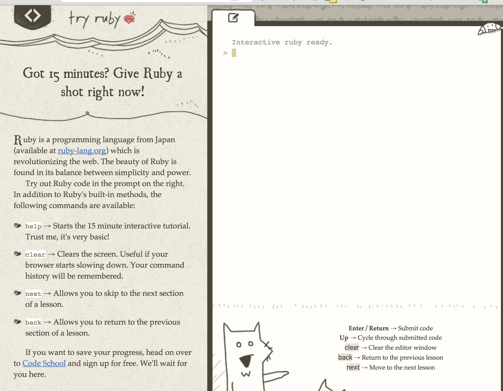
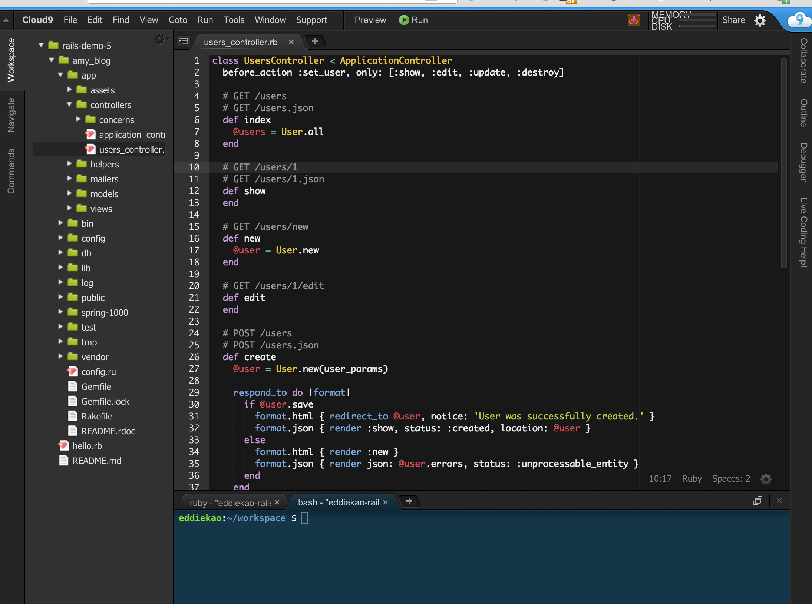

# 生態圈及簡介

- [Ruby 生態圈](#ruby-ecosystem)
- [關於 Ruby](#about-ruby)
- [關於 Rails](#about-rails)
- [常見問題](#faq)

----

## Ruby 生態圈

Ruby 這個程式語言可以說是因為 Rails 的盛行而興起的，我相信大部份的人會開始學習 Ruby 大多是因為 Rails 的緣故。事實上，在 Rails 風行之前，Ruby 這個程式語言也許可以說全世界幾乎只有日本的工程師在使用。

----

## 關於 Ruby
### 什麼是 Ruby?

很多人因為聽聞 Rails 可以快速開發網站而開始接觸 Ruby，所以會認為 Ruby 就是用來開發網站，或是覺得 Ruby 是個最近幾年才發明的程式語言。事實上 Ruby 是一種泛用的腳本式程式語言，從資料分析、繪圖、3D 建模、系統管理、遊戲開發等程式都可以使用 Ruby 開發，而且它的年紀已經超過 20 年了。

Ruby 是由一位名叫[松本行弘](https://zh.wikipedia.org/wiki/%E6%9D%BE%E6%9C%AC%E8%A1%8C%E5%BC%98)的日本人所發明(日文：まつもとゆきひろ，網路上大家通常稱他 Matz)。Ruby 參考了 Perl、Lisp 及 Smalltalk 等程式語言的設計，是一款物件化非常徹底的程式語言。在 1995 年釋出了第一個版本，在早期真的使用 Ruby 在工作上的開發者並不多，相關的技術文件也大多是日文居多，直到 Rails 開始風行之後，才慢慢的有越來越多人關注它。

### 為什麼選擇 Ruby

引用一句已故大師 Alan Perlis 的話：

> "A language that doesn't affect the way you think about programming is not worth knowing" — Alan Perlis

中文意思是：

>「如果某種程式語言不會影響你寫程式的思考方式的話，那就不值得去學習它。」

Ruby 是個很容易學、很容易上手的程式語言，語法寫起來也很自然、有趣，也因為 Ruby 的自然語法，寫久了的確會影響你在寫程式時候的思考或設計方式。

同時因為 Ruby 的語法寫起來很自然，所以用 Ruby 寫出來的程式碼的可閱讀性也相當高。不管是接手別人的專案，或是維護自己幾個月前寫的系統，比較好的可閱讀性對開發者來說可以減少不少負擔。

另外，現在全世界的 Ruby 社群都相當活躍，要找什麼套件幾乎都有熱心人士幫忙寫好了。除了可以免費取得之外，連原始程式碼都公開給你看。在台灣，Ruby 社群也是十分活躍，每個月都有實體的聚會，也有大型的國際程式研討會 [RubyConf Taiwan](http://rubyconf.tw)，每年都有不少國內外的 Ruby 開發者前來與會，連 Ruby 的發明人松本行弘也會遠從日本來台灣參加。

在本文撰寫的當下，官方最新推出的 Ruby 穩定版本是 2.3.3 版，較舊版本的 Ruby (1.8、1.9 或更早之前) 的部份功能也可能會被提到，但以下文章仍會以 2.3.3 版本為主。Ruby 2 系列對之前的版本有向下相容的特性，原本在 1.9 版可以正常執行的程式碼，在 2.0 應該也可以正常運作。

### 誰在用 Ruby?

很多人在評估程式語言的優劣，是看有哪些大公司、單位在使用它，或是使用的開發者人數。老實說我個人不是很關心這個問題，有些人覺得 Ruby 並不是很流行，在 [TIOBE](http://www.tiobe.com) 網站上的排名也不是非常前面，但我個人認為，好的東西不一定要流行，只要能完成任務的工具就是好工具。在 iPhone 還沒流行之前，誰也沒料到有一天 Objective-C 這個語法看起來很奇怪的程式語言有一天可以這麼熱門。

----

## 關於 Rails

### 什麼是 Rails?

Rails 是一款使用 Ruby 程式語言所開發出來的網站開發框架(Web Framework)，作者是名為 David Heinemeier Hansson (簡稱 DHH) 的丹麥人，當年他在開發自家的產品的同時，發現好像可以把一些網站開發常用的模組或函式庫組成一個框架，利用這個框架可以大大的縮短網站應用程式開發的時間。DHH 在 2005 年年底釋出第一個版本，並現場展示如何使用 Rails 在 15 分鐘內開發出一個 Blog，讓所有的人眼睛為之一亮，在那之後 Rails 慢慢的風行到全世界，也直接或間接的影響了其它框架的設計。

一開始的時候大家會把 Ruby on Rails 簡稱為「RoR」，不過因為「RoR」實在不好發音，後來大家開始慢慢的改稱之 Rails，包括本系列文章也是。

有些朋友在學習 Rails 過程中曾問道「即然 Rails 這麼方便，那有必要學 Ruby 嗎? 」。我的建議是：「是的，有必要。你也許不需要把 Ruby 學得非常熟，但至少你該學會在 Rails 裡常看到的 Ruby 語法」。

很多人一開始可能搞不清楚 Ruby 跟 Rails 之間的關係，如果打個比喻的話，大家也許看過或玩過樂高(Lego)積木，Rails 就像是一塊一塊的積木，可以讓你很快的把城堡蓋起來；而 Ruby 則像是積木的原料(塑膠)，沒有原料就不會有這個積木。

Ruby 是一款設計很特別、寫起來也很特別的程式語言，如果能花時間更去深入 Ruby 這個程式語言特別的點，相信在寫 Rails 的時候可以寫出更漂亮、簡潔、有效率的語法。

### Rails 設計哲學

Rails 的兩大設計哲學：

* 慣例優於設定 (Convention over Configuration, CoC)
* 不要做重複的事 (Don't Repeat Yourself, DRY)

#### 慣例優於設定 (Convention over Configuration, CoC)

所謂的「慣例」就像是不成文的規定，當遇到某種情況的時候我們會用某種方式來解決問題，不過即使不用這種方法，也有別的方法可以達到一樣的目的。

在 Rails 裡有相當多這樣的慣例，例如像是專案的目錄結構、資料表的關連及命名等，順著 Rails 的慣例，程式碼可以變得更簡潔、優雅。

甚至可以說在學習 Rails 的過程，除了學習 Ruby/Rails 的語法之外，也是在學習 Rails 的慣例。

#### 不要做重複的事 (Don't Repeat Yourself, DRY)

如果有些程式碼片段或結構一直重複的出現，就應該把重複的部份抽離出來，整理成為一個方法或類別。這樣的方法或類別不僅可以重複使用，也會因此變得比較好維護，Bug 也比較容易被發現。

----

## 常見問題

### 聽說寫 Ruby/Rails  要先買 Mac 電腦?

其實不需要的，使用 Mac 系統只是在開發環境上比較方便，但並不是必需品，即使用一般的 PC 安裝 Linux/Ubuntu 系統一樣可以進行開發。事實上，最後網站部署的環境也是 Linux/Ubuntu，所以不要聽信「要先學 Ruby/Rails 要先買 Mac」之類的江湖謠言。

當然，如果經濟許可，使用 Mac 電腦開發是件還滿開心的事。

### 用 Windows 可以嗎?

如果只是練習，Windows 勉強是可以的，因為在 Windows 也有打包好的懶人安裝包([Ruby Installer](https://rubyinstaller.org/) 及 [Rails Installer](http://railsinstaller.org/en))，但在 Windows 平台常常會遇到套件安裝失敗或不支援的問題。如果您平常的工作還是需要 Windows 的話，建議您可以使用 [VirtualBox](https://www.virtualbox.org/) 在 Windows 上安裝個 Linux/Ubuntu 的虛擬作業環境，可以少些麻煩。

### 一定要安裝在自己的電腦裡嗎?

也許因為某些因素，你無法在電腦上安裝 Ruby/Rails 環境(例如設備是借來的、公司內部管制，或是設備的記憶體不夠多，跑不動 VirtualBox 之類的軟體等)，也有其它線上的環境可以讓你練習。

如果只是想練一下 Ruby 的話，可以試試 [Try Ruby](http://tryruby.org/) 網站：

在畫面的左邊會一直出現要你完成的題目，右邊輸入區則是類似 Ruby 的 irb 環境。

如果想要在線上寫 Rails 的話，[c9.io](https://c9.io/) 這個線上平台也是個很不錯的選項：

c9.io 除了有線上開發環境外，也可直接在線上有預覽的功能。

事實上，在各種不同的硬體及作業系統安裝 Ruby/Rails 環境，對剛入門的新手來說是個很大的挑戰，所以不管在我們學校或是企業的教育訓練課程中，我們也常推薦大家直接使用 c9.io 之類的線上平台來進行練習。

