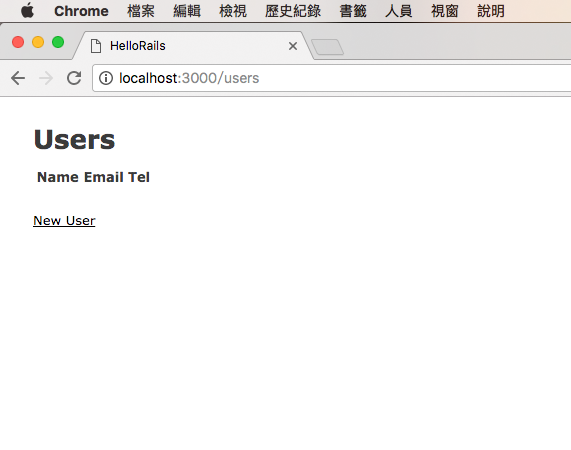
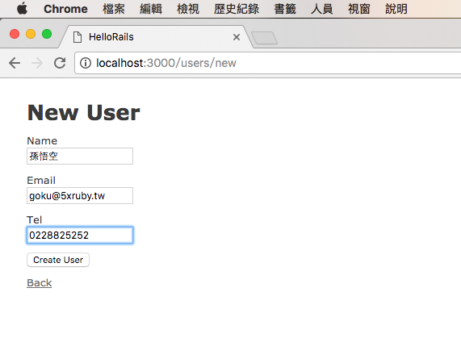
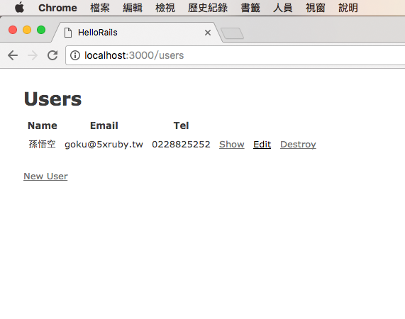
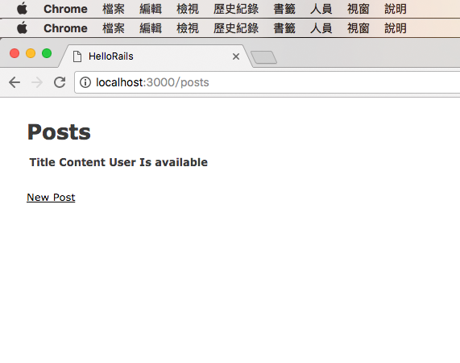
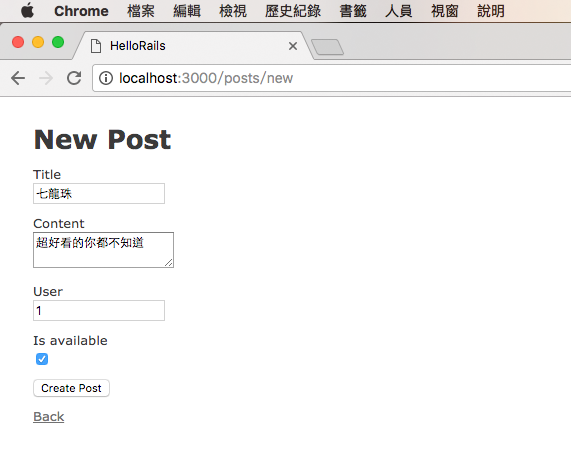
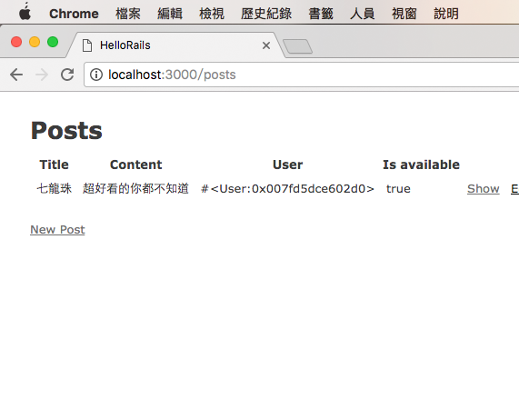
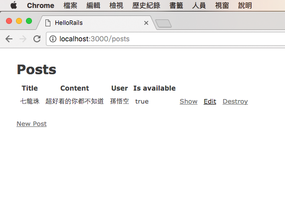

# 第一個應用程式(使用 Scaffold)

- [使用者功能](#user-scaffold)
- [文章功能](#post-scaffold)
- [Rails 常用快速鍵](#rails-shortcuts)
- [小結](#note)

在上一篇，我們建立了一個全新的 Rails 專案，讓我們接著用這個專案繼續往下做。

## 你的第一個 Rails 應用程式 (Blog 系統)

新手上路，讓我們來做一個讓使用者可以發文的 Blog 系統吧! 先想一下這個系統的使用者故事(User Story)大概會長什麼樣子：

- 可以新增使用者(User)
- 每個使用者(User)可以新增、修改或刪除自己寫的文章(Post)

雖然 Ruby 的世界有非常多厲害的套件(gem)，像是如果要做會員系統，只要用 [devise](https://github.com/plataformatec/devise) 就可以在幾分鐘甚至是幾十秒內就把會員註冊、登入、登出等基本的功能完成。不過這裡我們先不用任何套件，僅靠 Rails 內建的功能來完成它。

----

## <a name="user-scaffold"></a>使用者功能

### Step 1: 使用 Scaffold

我們先想一下使用者的資料大概會長什麼樣子：

| 欄位名稱 | 資料型態      |    說明        |
|:---------|:-------------:|:---------------|
|name      | 字串(string)  | 使用者姓名     |
|email     | 字串(string)  | 使用者 Email   |
|tel       | 字串(string)  | 聯絡電話       |

接下來，我們使用 Rails 內建的 Scaffold 功能來幫我們產生需要的檔案。切換到終端機畫面輸入指令：

    $ rails generate scaffold User name:string email:string tel:string
    Running via Spring preloader in process 17922
    Expected string default value for '--jbuilder'; got true (boolean)
          invoke  active_record
          create    db/migrate/20161220041724_create_users.rb
          create    app/models/user.rb
          invoke    test_unit
          create      test/models/user_test.rb
          create      test/fixtures/users.yml
          invoke  resource_route
          ..[略]..
          create      app/views/users/_user.json.jbuilder
          invoke  assets
          invoke    coffee
          create      app/assets/javascripts/users.coffee
          invoke    scss
          create      app/assets/stylesheets/users.scss
          invoke  scss
          create    app/assets/stylesheets/scaffolds.scss

打上面這個指令的時候，記得要先用 `cd` 指令切到 Rails 專案目錄裡，不然會出現不正確的訊息。這個 Scaffold 指令產生了一堆檔案，我們在後面的章節會再做更詳細的介紹，現在你只要先記得這個指令會幫你把 User 的新增、修改、刪除功能一口氣都做出來。

工程師其實有著懶惰的美德，所以上面這串很長的指令，可以濃縮成更簡單的樣子：

1. `generate` 可以簡寫成 `g`
2. 如果資料型態是 `string`，可以省略，但如果是其它型態不能省略。

所以原來的指令：

    $ rails generate scaffold User name:string email:string tel:string

可以簡寫成：

    $ rails g scaffold User name email tel

### Step 2 把描述具現化

在上一步產生的一堆檔案裡，有一個特別的檔案，在專案的 `db/migrate` 目錄裡，有個可能長得像 `20161220041724_create_users.rb` 的檔案(前面的數字是時間，所以可能會跟你的不一樣)，裡面的內容大概長這樣：

```ruby
class CreateUsers < ActiveRecord::Migration[5.0]
  def change
    create_table :users do |t|
      t.string :name
      t.string :email
      t.string :tel

      t.timestamps
    end
  end
end
```

內容現在看不懂沒關係，之後會再介紹，但大概可以從文字猜得出來它是要建立一個表格(table)，裡面有 `name`、`email` 以及 `tel` 三個欄位，分別都是字串(string)型態。

在 Rails 專案，這個檔案稱之遷移檔(migration file)，是個很重要的檔案，我們會在後面的章節再介紹。

現在要做的，就是執行這個遷移檔的描述，在資料庫建立一個名為 `users` 的表格，好讓我們把使用者的資料放進去。

    $ rails db:migrate
    == 20161220041724 CreateUsers: migrating ======================================
    -- create_table(:users)
       -> 0.0012s
    == 20161220041724 CreateUsers: migrated (0.0013s) =============================

這個指令就是做這件事，這樣就把 `users` 表格建好囉!

要注意的的是，在 Rails 5 之前，用的指令是 `rake db:migrate`，在 Rails 5 之後，雖然原來的 `rake` 指令也可用，但為了統一，所以許多原來的 `rake` 指令都搬到 `rails` 底下了。

### Step 3 啟動 Rails Server

到這裡，其實使用者的新增、修改、刪除功能已經完成了!! 這時候只要啟動 Rails Server 就行了。

    $ rails server
    => Booting Puma
    => Rails 5.0.0.1 application starting in development on http://localhost:3000
    => Run `rails server -h` for more startup options
    Puma starting in single mode...
    * Version 3.6.2 (ruby 2.3.3-p222), codename: Sleepy Sunday Serenity
    * Min threads: 5, max threads: 5
    * Environment: development
    * Listening on tcp://localhost:3000
    Use Ctrl-C to stop

如果想要少打幾個字，`rails server` 指令也可簡化成 `rails s`。接著打開瀏覽器，連上網址 `http://localhost:3000/users`，應該可以看到這個畫面：



試著輸入一些資料資料：



你會發現已經整個新增、修改、刪除的功能都完成了：



相當神奇吧!

----

## <a name="post-scaffold"></a>文章功能

完成了使用者功能，接著是文章(Post)功能，大致上也是依樣畫葫蘆，但還會加上一些這兩個功能之間的關連性。

再讓我們先想一下文章的資料大概會長什麼樣子：

| 欄位名稱    | 資料型態      |    說明      |
|:------------|:-------------:|:-------------|
|title        | 字串(string)  | 文章標題     |
|content      | 文字(text)    | 內文         |
|user_id      | 數字(integer) | 使用者編號   |
|is_available | 布林(boolean) | 文章是否上線 |

這裡有幾個需要解釋的地方：

1. 文字(text)跟字串(string)不同的地方，是在於 `text` 型態可以存放更多的內容(因為通常文章不會只有短短幾個字)。
2. `user_id` 欄位的目的，是為了可以讓該編文章跟某位使用者連結在一起。

### Step 1 使用 Scaffold

根據上面這個表格，我們使用 Scaffold 來產生相對應的功能：

    $ rails g scaffold Post title content:text user:references is_available:boolean
    Running via Spring preloader in process 18657
    Expected string default value for '--jbuilder'; got true (boolean)
          invoke  active_record
          create    db/migrate/20161220050455_create_posts.rb
          create    app/models/post.rb
          invoke    test_unit
          create      test/models/post_test.rb
          create      test/fixtures/posts.yml
          invoke  resource_route
          ..[略]..
          invoke  assets
          invoke    coffee
          create      app/assets/javascripts/posts.coffee
          invoke    scss
          create      app/assets/stylesheets/posts.scss
          invoke  scss
       identical    app/assets/stylesheets/scaffolds.scss

注意事項：

1. 除了 `string` 型態之外，其它型態不能省略。
2. 雖然 `user_id` 也可以用 `user_id:integer`，但使用 `user:references` 會幫你完成更多細節，這部份也一樣會在後面的章節介紹。

### Step 2 別忘了把描述具現化

跟前面的 User 一樣，Scaffold 又再產生了一個新的遷移檔，所以別忘了再讓這個描述檔執行一下：

    $ rails db:migrate
    == 20161220050455 CreatePosts: migrating ======================================
    -- create_table(:posts)
       -> 0.0056s
    == 20161220050455 CreatePosts: migrated (0.0057s) =============================

### Step 3 檢視成果

如果你剛剛的 Rails Server 還沒關掉(通常在開發過程不會特別關掉)，打開網址 `http://localhost:3000/posts`：



在 User 的欄位先填寫數字 `1`，表示是 1 號使用者：



這個 User 欄位其實不該讓使用者自己填空，至少是要自動帶入或是使用下拉選單，不過暫時先這樣。然後就可以看到：



這裡出現了看起來有點像亂碼的東西 `#<User:0x007fd5dce602d0>`，事實上它是一個使用者物件，我們可以修正一下程式碼，讓它顯示出使用者的姓名：

請打開專案的 `app/views/posts/index.html.erb` 檔案，把第 21 行的 `post.user` 改成 `post.user.name`，像這樣：

```
<% @posts.each do |post| %>
  <tr>
    <td><%= post.title %></td>
    <td><%= post.content %></td>
    <td><%= post.user.name %></td>
    <td><%= post.is_available %></td>
    <td><%= link_to 'Show', post %></td>
    <td><%= link_to 'Edit', edit_post_path(post) %></td>
    <td><%= link_to 'Destroy', post, method: :delete, data: { confirm: 'Are you sure?' } %></td>
  </tr>
<% end %>
```

應該就可以正常顯示了：



其實這裡還有一些效能問題(N+1 Query)，不過也讓我們留到以後再說明。

----

## <a name="rails-shortcuts"></a>Rails 常用快速鍵

這是一些常用到的快速鍵，可以讓你少敲幾個字：

* `rails generate` :point_right: `rails g`
* `rails destroy` :point_right: `rails d`
* `rails server` :point_right: `rails s`
* `rails console` :point_right: `rails c`
* `bundle install` :point_right: `bundle`

----

## <a name="note"></a>小結

Scaffold 好用歸好用，我當年第一次接觸 Rails 就是被 Scaffold 給騙進來的。但實際在工作的時候不見得常用，比較常見是手動建立 controller 或 model，畢竟 Scaffold 一口氣生出太多用不到的檔案，而且也有種用牛刀殺小雞的感覺。

基本上 Rails 是不可能靠用聽的或用看的就學得會的，一定多要練習，建議有空可試著照 Rails Guide 的這篇 [Getting Started](http://guides.rubyonrails.org/getting_started.html) 操練一遍，應該就對 Rails 更有概念了，加油!

有任何問題可於 [GitHub issue](https://github.com/kaochenlong/learn-ruby-on-rails/issues) 討論。原始碼可於 [這裡](https://github.com/kaochenlong/hello_rails) 取得

