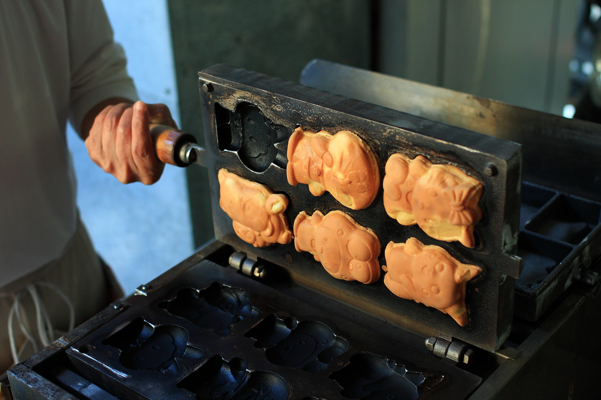

# 類別(Class)與模組(Module)

Rails 不是一種程式語言，它是一種用 Ruby 這個程式語言所開發出來的網頁開發框架 (Web Framework)。

接下來幾個章節的目的並不是要詳細的介紹 Ruby 這個程式語言所有的功能，而是希望讓大家對 Ruby 有足夠的基本認識，之後大家在閱讀或撰寫 Rails 專案的時候，會比較知道 Rails 在寫些什麼。

- [類別 (Class)](#class)
- [模組 (Module)](#module)

## <a name="class"></a>類別 (Class)

Ruby 是一款物件導向程式語言(Objected-Oriented Programming, OOP)，在 Ruby 的世界裡，幾乎所有的東西都是物件。但，到底什麼是「物件」?

### 什麼是物件?

> 物件(object) = 狀態(state) + 行為(behavior)

在現實生活中，路上跑的車子、天上飛的鳥，你我他，看得到、摸得到的都可通稱為之物件(Object)。物件會有狀態跟行為，例如我這個人會有是「黑色頭髮」、「黃色皮膚」、「年紀 18 歲(?)」等狀態，也會有「吃飯」、「睡覺」、「走路」、「講話」等行為。

為了讓大家更容易學習程式設計，許多程式語言都有引進物件的概念，讓程式架構更容易組織、整理。而且 Ruby 又是一款物件化很徹底的程式語言，在 Ruby 的世界，看的到的幾乎都是物件，數字 1、字串 "hello"，陣列、Hash 都是物件。

### 等等，為什麼說「幾乎」?

「在 Ruby 裡所有東西都是物件」，但其實也是有例外的，在 Ruby 裡的 Block 就不是物件，Block 本身沒辦法單獨的存活在 Ruby 的世界裡。

### 什麼是類別?

大家也許在夜市有看過有人在賣雞蛋糕，有小貓、小狗或其它可愛動物造型，只要把調配好的麵粉糊倒進模具，壓一下，幾分鐘後就會有香噴噴又造型可愛的雞蛋糕可以吃了。


photo by [Bryan Liu](https://www.flickr.com/photos/bryanliu99/)

那個烤盤模具，就是類別(Class)的概念。如果沒意外，一樣形狀的模具，放一樣的原料進去，做出來雞蛋糕的型狀應該都會長得一樣。而這個做出來的雞蛋糕，以物件導向程式設計的概念來說便稱之「實體(instance)」。

### 定義類別

在 Ruby 要定義一個類別，使用的關鍵字是 `class`：

```ruby
class 類別的名字
  #...
end
```

如果我想定義一個小貓類別，順便在裡面先定義好一些方法，就可以這樣寫：

```ruby
class Cat
  def eat(food)
    puts "#{food} 好好吃!!"
  end
end
```

其中，類別的名字規定必須是常數，也就是必須是大寫英文字母開頭。有了 `Cat` 類別之後，就可以用這個類別的 `new` 方法來產生實體：

```ruby
kitty = Cat.new
kitty.eat "鮪魚罐頭"  #=> 印出「鮪魚罐頭 好好吃!!」

nancy = Cat.new
nancy.eat "小魚餅干"  #=> 印出「小魚餅干 好好吃!!」
```

在這裡我用 Cat 類別做了兩個不同的實體，分別叫做 `kitty` 跟 `nancy`，這兩個物件因為都是用 `Cat` 類別做出來的，所以都有 `eat` 方法。

### 初始化

一樣形狀的烤盤，放入不同的原料就可以做出不同口味的雞蛋糕。一樣的概念，在使用 `new` 方法製作實體的時候，也可以順便傳參數進去。

```ruby
class Cat
  def initialize(name, gender)
    @name = name
    @gender = gender
  end

  def say_hello
    puts "hello, my name is #{@name}"
  end
end

kitty = Cat.new("kitty", "female")
kitty.say_hello    # => hello, my name is kitty
```

如果要透過 `new` 方法傳參數進來，在類別裡面必須有個名為 `initialize` 的方法來接收傳進來的參數。在 `initialize` 方法裡，常見的手法是會把參數傳進來給內部的實體變數(instance variable)。

### 實體變數(instance variable)

在 Ruby 裡的實體變數是有一個 `@` 開頭的變數，顧名思義，是活在每個實體裡的變數，而且每個實體之間互不相影響。

以前面這段為例，`@name` 跟 `@gender` 就是實體變數。

在 Rails 專案中，實體變數常用的地方是 Controller 與 View 之間的溝通，例如以下這個例子，這是一個很常見的 Controller 的例子：

```ruby
class PostsController < ApplicationController
  def index
    @posts = Post.all    # 取得所有的 Post 資料
  end
end
```

更多細詳內容待後面的 MVC(Model, View, Controler) 章節再說明。

### 取用實體變數

Ruby 的實體變數沒辦法直接從外部取用，像這樣直接取用會發生錯誤訊息：

```ruby
kitty = Cat.new("kitty", "female")
kitty.name = "nancy"     # 這會發生錯誤
puts kitty.name          # 這也會發生錯誤
```

Ruby 並沒有「屬性」(property/attribute)這樣的東西，要取用實體變數，需要另外定義的方法才行：

```ruby
class Cat
  def initialize(name, gender)
    @name = name
    @gender = gender
  end

  def say_hello
    puts "hello, my name is #{@name}"
  end

  def name
    @name
  end

  def name=(new_name)
    @name = new_name
  end
end

kitty = Cat.new("kitty", "female")
kitty.name = "nancy"
puts kitty.name        # => nancy
```

這裡定義的 `name` 以及 `name=` 方法(是的，你沒看錯，等號 `=` 也是方法的一部份)就是負責回傳及設定 `@name` 這個實體變數的。

每次要這樣取用或設定都要這麼麻煩嗎? 還好，怕麻煩的工程師有另外定義了三個方法來解決這件事，分別是 `attr_reader`、`attr_writer` 以及 `attr_accessor`。這三個方法分別會做出「讀取」、「設定」以及「讀取+設定」的方法出來，所以原來的有點囉嗦的寫法就可改成這樣：

```ruby
class Cat
  attr_accessor :name

  def initialize(name, gender)
    @name = name
    @gender = gender
  end

  def say_hello
    puts "hello, my name is #{@name}"
  end
end
```

### 實體方法與類別方法

依據方法作用的對像不同，有分實體方法(instance method)及類別方法(class method)，舉個例子來說：

```ruby
kitty = Cat.new("kitty", "female")
kitty.say_hello
```

這個 `say_hello` 是作用在 `kitty` 這個實體，所以稱這個 `say_hello` 為實體方法。如果是這樣：

```ruby
class PostsController < ApplicationController
  def index
    @posts = Post.all    # 取得所有的 Post 資料
  end
end
```

這裡的 `all` 方法是直接作用在 `Post` 這個類別上，故稱之類別方法。在 Ruby 要定義類別方法有幾種寫法，其中一種比較簡單的，就是在前面加上 `self`：

```ruby
class Cat
  def self.all
    # ...
  end
end
```

這樣就可以直接用 `Cat.all` 的方式呼叫了。

### 繼承 (Inheritance)

到目前為止的範例都是只有單一類別，但在真實的世界裡其實是更複雜的，像是如果想要再加入一個小狗類別：

```ruby
class Cat
  def eat(food)
    puts "#{food} 好好吃!!"
  end
end

class Dog
  def eat(food)
    puts "#{food} 好好吃!!"
  end
end
```

不管是 Cat 或 Dog 類別都有定義了一樣功能的 `eat` 方法，在物件導向的概念裡，通常會把相同功能的方法移到上一層的類別裡，然後再去繼承它：

```
class Animal
  def eat(food)
    puts "#{food} 好好吃!!"
  end
end

class Cat < Animal
end

class Dog < Animal
end
```

在這裡我定義了一個 Animal 類別，然後讓 Cat 跟 Dog 都去繼承它，那個小於符號 `<` 就是繼承的意思。這樣一來，就算 Cat 跟 Dog 類別空空的什麼都沒寫，也一樣都可以執行 `eat` 方法。雖然 Cat 跟 Dog 是不同的類別，但我們可以說「Cat 是一種 Animal，Dog 也是一種 Animal」，利用這樣的設計，可以把程式碼整理得更漂亮，不會寫出一堆重複的程式碼。

### 開放類別 (Open Class)

大家請先看一下這段程式碼：

```ruby
class Cat
  def abc
    # ...
  end
end

class Cat
  def xyz
    # ...
  end
end

kitty = Cat.new
kitty.abc       # => 會發生什麼事?
kitty.xyz       # => 會發生什麼事?
```

一個不小心，定義了兩個 `Cat` 類別，所以你可能會猜，後面寫的類別會蓋掉前面先寫的類別，所以 `kitty.xyz` 可正常運作，但 `kitty.abc` 會出錯。

在 Ruby 裡，如果遇到兩個一樣名字的類別，其實並不會「覆蓋」，而是會進行「融合」，上面這兩個類別最後會變成：

```ruby
class Cat
  def abc
    # ...
  end

  def xyz
    # ...
  end
end
```

然後 `abc` 跟 `xyz` 兩個方法都可以正常執行。利用這個特性，可以做出有趣的效果：

```ruby
class String
  def say_hello
    "hi, I am #{self}"
  end
end

puts "eddie".say_hello  # => hi, I am eddie
puts "kitty".say_hello  # => hi, I am kitty
```

在這裡定義了一個 `say_hello` 方法，在那之後所有的字串就都有 `say_hello` 方法可以用了。等等，那個 `String` 類別不是內建的類別嗎? 是的，你沒看錯，在 Ruby 即使是內建的類別，也是可以幫它「加料」的，這個技巧稱之開放類別(Open Class)。

這是我個人很喜歡的功能，雖然有些人會認為這樣感覺很恐怖，竟然連內建的類別都可以修改，但我想大家都是大人了，應該不會沒事亂 open 然後去惡搞自己或自己的同事吧。事實上，Rails 本身也正是利用這個特性，讓程式碼的可讀性變得更好，例如：

```ruby
puts 3.days.ago    # => Wed, 21 Dec 2016 12:06:13 UTC +00:00
puts 10.megabyte   # => 10485760
```

這樣不是很酷嗎 :)

## <a name="module"></a>模組 (Module)

如果我有一隻小貓類別，我想要這個小貓類別有飛行功能，應該怎麼做? 也許你會想到用「繼承」的做法：

> 我只要讓小貓類別去繼承小鳥類別就好啦，反正小鳥會飛，所以繼承之後的小貓就會飛了!

1. 直接寫一個有飛行功能的小鳥類別，然後再叫小貓類別去繼承它?

2. 直接把飛行功能寫在小貓類別裡?

第 1 種做法的設計有點怪怪的，好好的貓不當，為什麼要去當鳥? 為了想要有飛行功能就去當別人家的小孩...

第 2 種做法看來似乎可行，但如果之後又有個「我希望我的這個小狗類別也會飛!」的需求，那這樣又得在小狗類別裡寫一段飛行功能，程式碼沒辦法共用。

這時候，模組就可以派上用場了。

### 飛行模組

在 Ruby 定義模組，使用的是 `module` 這個關鍵字：

```ruby
module Flyable
  def fly
    puts "I can fly!"
  end
end
```

寫起來的手感跟類別一樣，連模組名字的規定也跟類別一樣，必須是常數(也就是大字英文字母開頭)。定義好了之後，如果要把它拿來用，只要用 `include` 這個方法：

```ruby
class Cat
  include Flyable
end

kitty = Cat.new
kitty.fly        # => I can fly!
```

就可以把這個飛行模組掛上去，然後小貓就會飛了! 如果之後小狗類別也想要會飛的話，只要這樣：

```ruby
class Dog
  include Flyable
end
```

小狗也會飛了。

### 要用繼承還是要用模組?

基本上，如果你發現你要做的這個功能，它可能在很多不同體系的類別裡都會用得到，那你可以考慮把功能包在模組裡，然後在必要的時候再 include 進來即可。但如果你還是不知道到底類別跟模組有什麼差別，我再舉二個例子。

不知道大家有沒看過[火影忍者](http://zh.wikipedia.org/wiki/%E7%81%AB%E5%BD%B1%E5%BF%8D%E8%80%85)這部漫畫，漫畫裡的主人公之一，宇智波佐助，因為他們家族血統的關係，他寫輪眼這個功能是天生就有的，這個功能是從他的家族「繼承」來的。而佐助的老師，旗木卡卡西，他雖然也有寫輪眼功能，但他的寫輪眼並非繼承來的，事實上是他在年輕時候 include 了某個寫輪眼模組，所以才有這個效果。

另一個例子，[海賊王](http://zh.wikipedia.org/wiki/ONE_PIECE)漫畫裡，魯夫本來是普通人，但在偶然的機會下，他 include 了橡膠果實之後，他就有了橡膠人的能力了，並不是因為他老爸是橡膠人所以他才是橡膠人。

### 在 Rails 專案中，模組用在哪些地方?

在 Rails 專案中其實還不少地方有用到模組，主要有用在 View 的 Helper 以及 Model 跟 Controller 的 Concern，這待到後面的 Rails 章節再做詳細的介紹。

