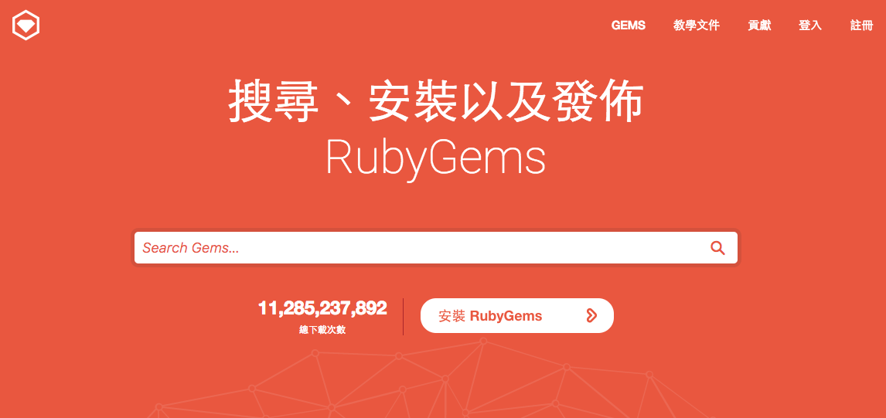
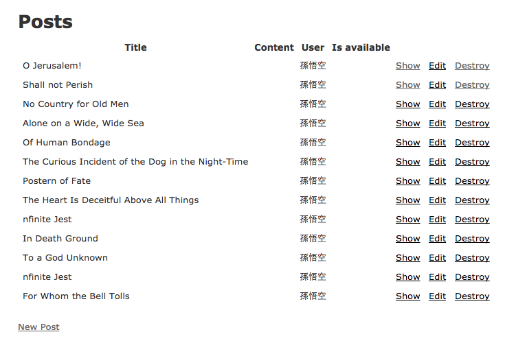
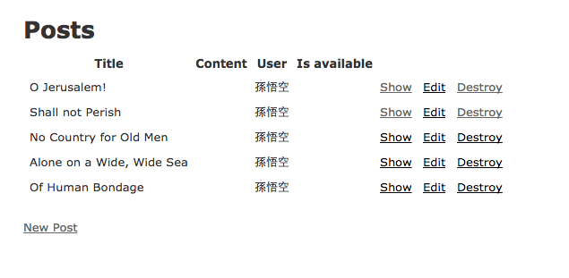
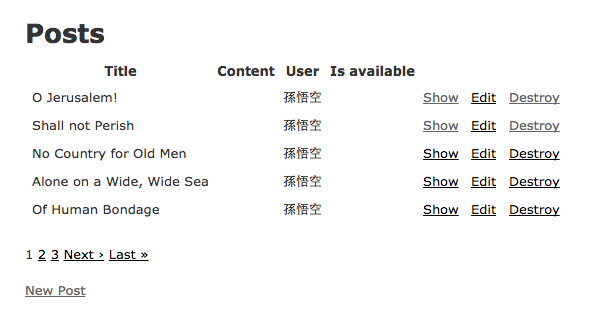

# 使用套件(gem)讓開發更有效率

- [安裝套件](#install-gem)
- [使用 gem 來加速開發](#using-gem)
- [小結](#note)

在開放原始碼的世界，有非常多厲害開發者願意無私的貢獻程式碼，而這些程式碼大多會打包成好用的套件，在 Ruby 的世界，我們稱它為 gem。所有 gem 的詳細資訊，都可在 [RubyGems](https://rubygems.org/) 網站上找得到：



## <a name="install-gem"></a>安裝套件

在 Ruby 要安裝套件超簡單的，只要 `gem install` 指令加上套件的名字，敲完按下 Enter 鍵，就自動會連上網路、下載套件、安裝套件，一氣呵成。例如我想安裝一個名為 `takami` 的套件：

    $ gem install takami
    Fetching: takami-0.0.1.gem (100%)
    Successfully installed takami-0.0.1
    Parsing documentation for takami-0.0.1
    Installing ri documentation for takami-0.0.1
    Done installing documentation for takami after 0 seconds
    1 gem installed

如果該套件又有需要其它套件，它也會一併順便一起下載、安裝。這個 `takami` 是我自己寫的 gem，裡面沒有任何功能，僅是上課時教同學們怎麼把程式碼打包成 gem 的範例，所以可安心安裝!(咦?!)

### 所以我說那個套件呢?

安裝 gem 很簡單，但安裝好了之的那些檔案放哪去了? 執行 `gem env` 可列出目前在這台電腦的設定：

    $ gem env
    RubyGems Environment:
      - RUBYGEMS VERSION: 2.6.8
      - RUBY VERSION: 2.3.3 (2016-11-21 patchlevel 222) [x86_64-darwin15]
      - INSTALLATION DIRECTORY: /Users/user/.rvm/gems/ruby-2.3.3
      - USER INSTALLATION DIRECTORY: /Users/user/.gem/ruby/2.3.0
      - RUBY EXECUTABLE: /Users/user/.rvm/rubies/ruby-2.3.3/bin/ruby
      ... 略 ...

那個 `INSTALLATION DIRECTORY` 就是 gem 安裝的地方，裡面翻一下應該就可以找得到剛剛安裝的 `takami` 套件了。因為我是使用 [RVM](https://rvm.io/)，所以 gem 的安裝路徑會在 .rvm 目錄裡。

### 使用 gem

gem 裝好了要怎麼使用呢? 剛好趁這個機會介紹一個我很喜歡的 gem：[Faker](https://github.com/stympy/faker)。這個套件可以快速的產生很多種的看起來像真的「假資料」。

安裝一下套件：

    gem install faker

安裝完成之後，開 Ruby 內附的互動小工具 `irb` 來試玩一下：

    $ irb
    # 先 require 這個套件
    >> require 'faker'
    => true

    # 產生假的 Email
    >> Faker::Internet.email
    => "lynn.raynor@grahamcartwright.net"

    >> Faker::Internet.email
    => "guiseppe@jones.net"

    # 連權利遊戲的假資料都有
    >> Faker::GameOfThrones.character
    => "Ned Stark"

    >> Faker::GameOfThrones.character
    => "Stannis Baratheon"

做測試的時候用這個 gem 來產生假資料相當方便!

## 在 Rails 專案裡使用 gem

如果要在 Rails 專案中使用 gem 的話，需要把要使用的 gem 標註在專案目錄下的 `Gemfile`。打開 `Gemfile`，大概會長得像這樣：

```ruby
source 'https://rubygems.org'

gem 'rails', '~> 5.0.0', '>= 5.0.0.1'
gem 'sqlite3'
gem 'puma', '~> 3.0'
gem 'sass-rails', '~> 5.0'
gem 'uglifier', '>= 1.3.0'
gem 'coffee-rails', '~> 4.2'
gem 'jquery-rails'
gem 'jbuilder', '~> 2.5'
#... [略] ...

group :development, :test do
  gem 'byebug', platform: :mri
end

group :development do
  gem 'web-console'
  gem 'listen', '~> 3.0.5'
  gem 'spring'
  gem 'spring-watcher-listen', '~> 2.0.0'
end

gem 'tzinfo-data', platforms: [:mingw, :mswin, :x64_mingw, :jruby]
```

在這個檔案裡，你可以看到有些 gem 的後面有加註版本號碼，有的沒有，這分別代表不同的意思：

### 沒加註版號

先從最簡單的來看。當後面沒有加註版本號碼的時候，像這樣：

```ruby
gem 'sqlite3'
gem 'jquery-rails'
```

這樣的寫法將會在安裝的時候選用「最新的穩定(stable)版本」，要注意這裡的重點是「穩定」而不是「最新」。以 Rails 來說，假設最新的版本是 5.0.0 beta 4，但最新的「穩定」版本是 4.2.6 版，當沒有加註版本號的時候，它會選擇安裝 4.2.6 版本。

### 加註明確版號

例如像這樣：

```ruby
gem "rails", "4.2.6"
```

這相當明顯了，這就是說「我要安裝 rails 4.2.6 版」，應該不需要特別解釋。

### 大於、小於版號

```ruby
gem 'uglifier', '>= 1.3.0'
```

我想這個光用看的就猜得出來，就是要選用大於或等於 1.3.0 版本。

```ruby
gem 'rails', '>= 5.0.0.beta4', '< 5.1'
```

這樣則是會選用在 5.0.0.beta4 跟 5.1 之間的版本。

### 差不多...

```ruby
gem 'coffee-rails', '~> 4.1.0'
```

這是指會選用 4.1.0 以上，但 4.2 以下(不含括 4.2)的最新版本。

為什麼這麼麻煩? 舉個例子來說，例如版本號 `4.2.6`，`4`、`2`、`6` 三個數字分別代表主要版號(Major)、次要版號(Minor)以及修訂版號(Patch)，分別表示：

* 主要版號：功能大改，公開的 API 做了不少修正，通常沒辦法向下不相容
* 次要版號：加了某些新功能，但不影響其它功能，向下相容
* 修訂版號：對現有的功能做了小幅度的修正，可向下相容

這是個不成文的規定(語義化版本)，雖然沒有強制，但幾乎大部份的 gem 作者都會依照這個規範。這個 `~>` 「差不多」的寫法，可以確保不會因為套件昇級而把原本正常運作的系統弄壞了。

## <a name="using-gem"></a>使用 gem 來加速開發

介紹完了 Gemfile 裡的內容，接下讓我們利用現有的 gem 來加速開發，舉個例子來說：



這個頁面的資料太多了，如果我只想呈現每頁 5 筆資料，通常得自己算每頁幾筆、現在是第幾頁、總共有幾頁這些數字(我數學不好，很不擅長算這種)。有位好心又很厲害的大大做了一個專門計算分頁的套件稱為 [Kaminari](https://github.com/amatsuda/kaminari)，可以很輕鬆的完成這件事：

### Step 1: 安裝套件

打開 `Gemfile`，加上這行：

```
gem 'kaminari'
```

> 重要：更新 Gemfile 檔案內容後，別忘了要到該專案目錄底下執行 `bundle install` 指令，確保所有套件都有正常安裝。

### Step 2: 修改程式碼

打開專案的 `app/controllers/posts_controller.rb` 檔案，把原來在 `index` 方法的 `Post.all` 做一些調整：

```ruby
class PostsController < ApplicationController
  before_action :set_post, only: [:show, :edit, :update, :destroy]

  # GET /posts
  # GET /posts.json
  def index
    @posts = Post.page(params[:page]).per(5)
  end

  ... [略] ...
end
```

那個 `page` 方法，是 Kaminari 這個套件專門拿來做分頁的方法，後面的 `per(5)` 就是「每頁有 5 筆資料」的意思。重新整理一下瀏覽器，應該會看到只剩 5 筆了：



(如果發生 page 方法找不到之類的錯誤訊息，可能重新啟動 Rails Server 之後就正常了)

但這樣還不夠，在畫面上還少了「上一頁」、「下一頁」的功能啊!! 沒關係，這個套件也幫你做好了。打開檔案 `app/views/posts/index.html.erb`，找一個你想要放分頁器的地方：

```erb
<p id="notice"><%= notice %></p>

<h1>Posts</h1>

<table>
  <thead>
  ...[略]...
  </tbody>
</table>
<br>

<%= paginate @posts %>

<br>
<%= link_to 'New Post', new_post_path %>
```

那行 `<%= paginate @posts %>` 會幫你把分頁器做出來。重新整理一下畫面：



就這樣，寫沒幾行程式碼就把分頁功能做完了!

## <a name="note"></a>小結

善用現有的套件可以大幅的縮短開發時程。這些 gem 的作者通常很愛現(稱讚意味)，他們大多會在說明文件裡詳細介紹這個套件怎麼用(怕你不會用)，所以，使用套件前應詳閱公開說明書(README)，如果有任何問題，也都歡迎留 issue 給作者們，通常很快就會被解答。

另外，有兩個網站推薦給大家參考：

- [RailsCasts](http://railscasts.com/)
- [GoRails](https://gorails.com/)

這兩個網站的影片都有介紹怎麼使用 gem，不過可惜 RailsCasts 網站已停止更新，但網站上的內容仍非常有參考價值。

