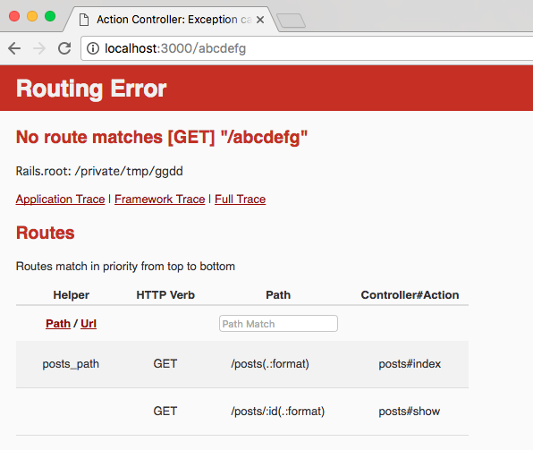
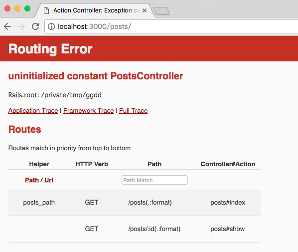
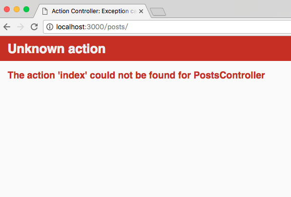
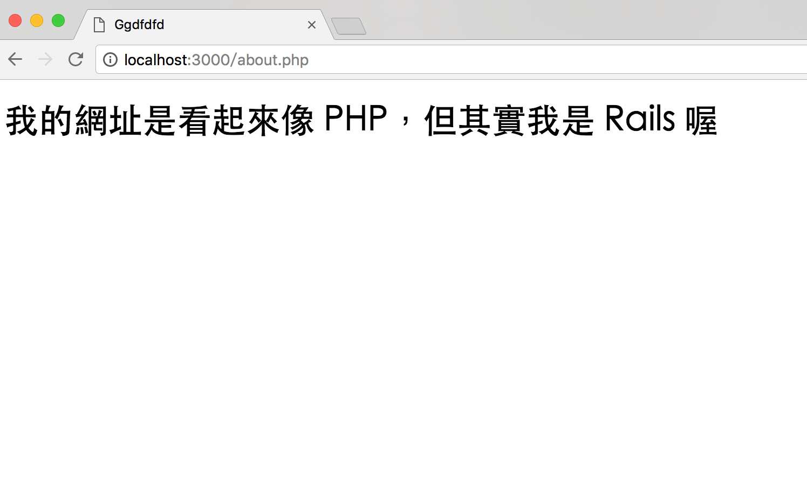

# Routes

- [Route 起步走](#route-intro)
- [RESTful 網址設計](#restful-routes)
- [資源 Resource](#resources)
- [後台網址設計](#namespace)

先讓我們回顧一下前一個章節的這張圖解：


Route 是整個網站對外公開的網站路徑對照表，當使用者連上你的網站的時候，Rails 會解析使用者所輸入的網址及參數，再根據解析的結果，去找到該負責處理的單位(哪個 Controller 跟 Action)。

## <a name="route-intro"></a>Route 起步走

舉個例子來說，這個網址：

    http://kaochenlong.com/posts/123

Rails 會根據 `config/routes.rb` 這個檔案的內容，比對在網址後面的 `/posts/123` 應該交給誰處理，假設檔案內容如下：

```ruby
Rails.application.routes.draw do
  get "/posts", to: "posts#index"
  get "/posts/:id", to: "posts#show"
end
```

其中，這兩行：

```ruby
get "/posts", to: "posts#index"
get "/posts/:id", to: "posts#show"
```

的意思就是，「當使用者輸入 `posts` 這個網址，它會交由 `posts#index` 來處理，也就是 `PostsController` 上的 `index` 方法；同理，當使用者輸入 `/posts/123` 這個網址之後，它會轉由 `PostsController` 上的 `show` 方法，並且把 `123` 當做參數(:id)傳給 Controller」。

想像一下這個情境：

> 客人上門了...
>
> 客人：「你好，我想要看所有的文章列表(輸入網址 `/posts`)」
>
> Route：「好的，我幫你轉接到 `PostsController` 部門的 `index` 櫃台，請他幫您服務」
>
> 客人：「等等，我改變主意了，我只想要看第 87 號文章就好(輸入網址 `/posts/87`)」
>
> Route：「沒問題，請您一樣到 `PostsController` 部門，但這次請找 `show` 櫃台，並且把 `87` 這個號碼牌給他，他會替您調閱資料」
>
> 客人：「那請問可以給我看看使用者的列表嗎 (輸入網址 `/users`)」
>
> Route：「不好意思，目前我們沒有相關資料喔 (回應 HTTP 404)」

Route 的角色就類似是這樣，負責解讀使用者輸入的網址，然後轉去對應的地方，剩下的，就是 MVC(Model, View, Controller) 你們的事了。但如果找不到路徑，會出現 `HTTP 404` 找不到頁面的錯誤訊息，在開發模式下會出現這個畫面：



### Route 跟 Controller 的關係

根據 MVC 的圖解說明，Route 是告知這個需求要去找哪個 Controller 的哪個 Action

再想像一下這個情境：

> 客人又上門了
>
> 客人：「我想要看所有的文章列表(輸入網址 `/posts`)」
>
> Route: 「好的，我幫你轉接到 `PostsController` 部門的 `index` 櫃台，請他幫您服務」
>
> 客人想要依照指示前往 `PostsController` 部門，發現根本沒有這個部門!!

然後就會看到這個畫面：



這個 `uninitialized constant PostsController` 錯誤訊息是指找不到 `PostsController` 這個常數，其實就是指找不到這個類別。

> 客人又再次上門了
>
> 客人：「我想要看所有的文章列表(輸入網址 `/posts`)」
>
> Route: 「好的，我幫你轉接到 `PostsController` 部門的 `index` 櫃台，請他幫您服務」
>
> 客人依照指示來到 `PostsController` 部門，這次有找到部門了，但卻發現沒有 `index` 這個櫃台!!



也就是說，即使 Route 有這條路徑，也不表示那個 Controller 就檔案就一定需要事先存在；就算 Controller 存在，也不表示 Action 存在。所以下回看到這些錯誤訊息就不用太擔心了。

### 檢視目前所有的路徑

假設我們目前 `config/routes.rb` 的設定如下：

```ruby
Rails.application.routes.draw do
  get "/posts", to: "posts#index"
  get "/about", to: "pages#about"
end
```

你可以在終端機底下執行 `rails routes` 指令，看看目前所有的路徑設定：

    $ rails routes
    Prefix Verb URI Pattern      Controller#Action
     posts GET  /posts(.:format) posts#index
     about GET  /about(.:format) pages#about

> 注意：如果你用 Rails 版本是 4.x 版，請使用 `rake routes`

### 首頁網址設定

要設定首頁路徑可以這樣做：

```ruby
get "/", to: "welcome#index"
```

不過 Rails 提供一個更簡單的寫法：

```ruby
root "welcome#index"
```

### 轉址

Route 除了做路徑對照外，也可以直接做轉址：

```ruby
get '/users', to: redirect('/accounts')
```

這樣一來就可以把 `/users` 轉往 `/accounts` 了；除了站內網址外，也可直接轉到外部網站：

```ruby
get '/5xruby', to: redirect('https://5xruby.tw')
```

這樣當使用者輸入 `/5xruby` 這個網址的時候，就會立馬被轉址到指定的網站了。

### 見山不是山，看到 PHP 一定是 PHP 嗎? 假的!

在以前，當我們看到這樣的網址：

    http://kaochenlong.com/posts/edit.php?id=2

應該就會猜「在這個網站上，有一個名為 `posts` 的目錄，然後裡面有個 `edit.php` 的 PHP 程式檔案」。但事實上在 Rails 的 Route 不是這個概念，檔案不一定需要真的存在在對應的檔案或目錄。

另外，大家也習慣從網頁的檔案來判斷這個頁面是用什麼程式語言寫的，但事實上這個也是可以造假的，例如：

```ruby
Rails.application.routes.draw do
  get '/about.php', to: 'pages#about'
end
```

當網址是 `about.php` 的時候，會轉由 `pages_controller` 的 `about` 方法處理。



網址看起來是 PHP，但實際上它是 Rails 喔 :)

### Route 的順序

如果不小心在 Route 裡這樣寫：

```ruby
Rails.application.routes.draw do
  get "/about", to: "pages#about"
  get "/about", to: "products#about"
end
```

查一下路由會發現兩條路由是並存的：

    $ rails routes
      Prefix Verb URI Pattern      Controller#Action
       about GET  /about(.:format) pages#about
             GET  /about(.:format) products#about

如果遇到這種情況，在 Route 進行比對的時候，在前面先查到的就會先生效，也就是說寫在後面的會被覆蓋，等於是白寫的了。

## <a name="restful-routes"></a>RESTful 網址設計

[REST](https://zh.wikipedia.org/wiki/REST) 是 Representational State Transfer 的縮寫，中文翻譯成「具象狀態傳輸」，它是由 Roy Thomas Fielding 博士在 2000 年時提出的軟體架構。簡單的說，就是把每個網址當做資源(Resource)來看待，對同一個資源做不同的動作 (HTTP Verb) 會得到不同的結果。符合 REST 概念設計的網址，又稱之 RESTFul Route。

### 有什麼好處?

假設某網站的會員系統「編輯會員個人資料」功能的網址是：

    http://kaochenlong.com/member_edit.php?id=2

在換了不同開發人員接手後，可能會變這樣：

    http://kaochenlong.com/edit_member.php?id=2

網址(或檔名)的設計如果沒有統一的規則，有的用 `member_edit.php`，有的用 `edit_member.php`，對後面接手的開發者來說就會不知道哪個檔案才是正在使用的版本，甚至可能得用最後修改日期去猜。

但如果是在 Rails 的話比較沒這困擾，如果 `member` 當做「資源」的話，那「編輯會員個人資料」的網址大概會長這樣：

    http://kaochenlong.com/members/2/edit

如果想要看這位會員的資料則是：

    http://kaochenlong.com/members/2

同理，如果把「會員」換成「商品」：

    # 檢視 2 號商品
    http://kaochenlong.com/products/2

    # 編輯 2 號商品
    http://kaochenlong.com/products/2/edit

依此類推。

導入 REST 的設計，可讓網址變得更直觀，而且也替幫開發人員訂了一套網址設計的慣例。當你對某個網址使用 `POST` 方法存取表示是新增資料；當使用 `PUT` 或 `PATCH` 方法表示是更新資料，使用 `DELETE` 方法則是表示刪除資料。不管是老鳥或是新手，大多都會遵照這個慣例來設計。再加上 Rails 專案本身的結構跟其它的慣例，只要不要用太奇怪的寫法，專案不論大小都應該很快的可以猜出來哪個頁面是放在哪個檔案裡。

## <a name="resources"></a>資源 Resource

要符合 RESTful 的網址設計，除了自己一條一條自己寫之外，更建議直接使用 Rails 提供的 `resources` 方法：

```ruby
Rails.application.routes.draw do
  resources :users
end
```

在 Route 裡加上這行後，使用 `rails routes` 指令來查看一下：

    $ rails routes
       Prefix Verb   URI Pattern               Controller#Action
        users GET    /users(.:format)          users#index
              POST   /users(.:format)          users#create
     new_user GET    /users/new(.:format)      users#new
    edit_user GET    /users/:id/edit(.:format) users#edit
         user GET    /users/:id(.:format)      users#show
              PATCH  /users/:id(.:format)      users#update
              PUT    /users/:id(.:format)      users#update
              DELETE /users/:id(.:format)      users#destroy

就會發現，這樣短短一行 `resources :users`，Rails 就幫你做出 8 條不同的路由並且對應到 Controller 的 7 個方法。讓我們把這些路由做個簡單的表格說明：

| 動詞   | Prefix     | 路徑            |  Controller    | Aciton  | 說明            |
|--------|------------|-----------------|----------------|---------|-----------------|
| GET    | users      | /users          | UserController | index   | 使用者列表      |
| POST   | users      | /users          | UserController | create  | 新增使用者      |
| GET    | new_users  | /users/new      | UserController | new     | 新增使用者頁面  |
| GET    | edit_users | /users/:id/edit | UserController | edit    | 編輯使用者頁面  |
| GET    | user       | /users/:id      | UserController | show    | 檢視單一使用者  |
| PATCH  | user       | /users/:id      | UserController | update  | 更新使用者      |
| PUT    | user       | /users/:id      | UserController | update  | 更新使用者      |
| DELETE | user       | /users/:id      | UserController | destroy | 刪除使用者      |

### 前面那個 prefix 是幹嘛的?

在 `rails routes` 指令所秀出來的各項資訊中，有一欄叫 `Prefix`：

    $ rails routes
          Prefix Verb   URI Pattern                        Controller#Action
        products GET    /products(.:format)          products#index
                 POST   /products(.:format)          products#create
     new_product GET    /products/new(.:format)      products#new
    edit_product GET    /products/:id/edit(.:format) products#edit
         product GET    /products/:id(.:format)      products#show
                 PATCH  /products/:id(.:format)      products#update
                 PUT    /products/:id(.:format)      products#update
                 DELETE /products/:id(.:format)      products#destroy

它在後面接上 `_path` 或 `_url` 後可以變成「產生相對應的路徑或網址」的 View Helper。如果是站內連結，通常會使用 `_path` 寫法來產生站內的路徑，例如：

    products + path     = products_path         => /products
    new_product + path  = new_product_path      => /products/new
    edit_product + path = edit_product_path(2)  => /products/2/edit

如果是使用 `_url` 則會產生完整的路徑，包括主機網域名稱：

    products + url     = products_url         => http://kaochenlong.com/products
    new_product + url  = new_product_url      => http://kaochenlong.com/products/new
    edit_product + url = edit_product_url(2)  => http://kaochenlong.com/products/2/edit

通常在寄發 Email 的時候會在信件內容裡使用 `_url` 的完整路徑寫法。

### 問題：resources 後面一定要是複數嗎?

其實不一定，這只是 Rails 的其中一個慣例罷了，不遵照這個慣例其實也不會怎麼樣，例如這樣寫：

```ruby
Rails.application.routes.draw do
  resources :user
end
```

這樣寫所產生的路由會是：

    $ rails routes
        Prefix Verb   URI Pattern                        Controller#Action
    user_index GET    /user(.:format)                    user#index
               POST   /user(.:format)                    user#create
               GET    /user/new(.:format)                user#new
               GET    /user/:id/edit(.:format)           user#edit
               GET    /user/:id(.:format)                user#show
               PATCH  /user/:id(.:format)                user#update
               PUT    /user/:id(.:format)                user#update
               DELETE /user/:id(.:format)                user#destroy

一樣是 8 個路由對應到 CRUD 相關的 7 個方法，但原本會對到 `users_controller` 會變成 `user_controller`，這點需要稍微注意一下。

### 如果不要這麼多路由...

`resources` 方法可以便利做出 CRUD 相對應的路由，但這個方法一口氣就會做出 8 個。如果有時候不需要這麼多，舉個例子來說，如果一般使用者不需要對商品有「新增」、「修改」及「刪除」功能，僅需要「檢視」功能的話，可以使用 `only` 或 `except` 參數來調整產生的路由數量：

```ruby
Rails.application.routes.draw do
  resources :products, only: [:index, :show]

  # 或是反過來這樣寫也行
  # resources :products, except: [:new, :create, :edit, :update, :destroy]
end
```

`only` 跟 `except` 兩種寫法剛好是相反效果，可視需求挑選寫起來比較簡短的。

以上面這個例子來說，需要的路由只有一、二個，雖然不靠 `resources` 方法直接寫也可以，但除了一些靜態頁面外，仍建議採用 `resources` 的寫法再加上 only 或 except 來調整數量，以維持整體路由的慣例。

### 單數的 Resource

這裡指的單數 Resource 不是上面這個單數名詞，而是 `resource` 方法本身就是單數的，這個跟複數的 resources 方法的差別在於「單數 resource 方法不會做出含有 `:id` 的路徑」，例如：

```ruby
Rails.application.routes.draw do
  resource :profile
end
```

跟複數的 `resources` 有點像，但單數的 `resource` 方法僅會造出 7 個路由，像這樣：

    $ rails routes
          Prefix Verb   URI Pattern             Controller#Action
         profile POST   /profile(.:format)      profiles#create
     new_profile GET    /profile/new(.:format)  profiles#new
    edit_profile GET    /profile/edit(.:format) profiles#edit
                 GET    /profile(.:format)      profiles#show
                 PATCH  /profile(.:format)      profiles#update
                 PUT    /profile(.:format)      profiles#update
                 DELETE /profile(.:format)      profiles#destroy

跟複數的 resources 比起來，單數的路徑除了沒有帶有 `id` 之外，也沒有 `index`。

什麼時候會用到單數 resource ，什麼時候用複數 resources? 舉例來說，像是會員個人 profile，如果想要設計「使用者只能檢視、更新、刪除自己的 profile」的效果就可使用單數 resource，網址就會長得像：

    /profile

但如果想要設計的是「系統管理員可以檢視、更新、刪除每個使用者的 profile」的話，則使用複數 resources，網址就會像這樣：

    /profiles/2

### 大腸包小腸的巢狀設計

`resources` 方法裡面其實還可以再繼續包 `resources`，像這樣：

```ruby
Rails.application.routes.draw do
  resources :users do
    resources :posts
  end
end
```

這樣一來產生的結果會是：

    $ rails routes
            Prefix Verb   URI Pattern                              Controller#Action
        user_posts GET    /users/:user_id/posts(.:format)          posts#index
                   POST   /users/:user_id/posts(.:format)          posts#create
     new_user_post GET    /users/:user_id/posts/new(.:format)      posts#new
    edit_user_post GET    /users/:user_id/posts/:id/edit(.:format) posts#edit
         user_post GET    /users/:user_id/posts/:id(.:format)      posts#show
                   PATCH  /users/:user_id/posts/:id(.:format)      posts#update
                   PUT    /users/:user_id/posts/:id(.:format)      posts#update
                   DELETE /users/:user_id/posts/:id(.:format)      posts#destroy
             users GET    /users(.:format)                         users#index
                   POST   /users(.:format)                         users#create
          new_user GET    /users/new(.:format)                     users#new
         edit_user GET    /users/:id/edit(.:format)                users#edit
              user GET    /users/:id(.:format)                     users#show
                   PATCH  /users/:id(.:format)                     users#update
                   PUT    /users/:id(.:format)                     users#update
                   DELETE /users/:id(.:format)                     users#destroy

從產生的網址來解讀的話：

| 網址                   | 說明                        |
|------------------------|-----------------------------|
| /users/2               | 檢視 2 號使用者的資料       |
| /users/2/posts         | 2 號使用者的所有文章        |
| /users/2/posts/3       | 檢視 2 號使用者的 3 號文章  |
| /users/2/posts/3/edit  | 編輯 2 號使用者的 3 號文章  |

但實際在寫的時候會建議最多只要二層 Resources 就好，雖然可以再繼續包下去，但再包下去可能長出像這樣的東西：

    /users/2/posts/3/comments/5

網址太長，而且事實上這樣設計也是沒必要的，舉例來說：

    /users/2/posts/3

這個網址，看起來可以取得 2 號使用者的第 3 號文章，但事實上文章編號是自動跳號且不會重複的流水編號，所以並不需要知道使用者是誰也可以找得到這篇文章，像這樣：

    /posts/3

不僅網址較短，也比較清楚就是要「檢視 3 號文章」。事實上「編輯」、「更新」以及「刪除」功能也沒有必要一定要跟在 User 後面，所以原來這樣大腸包小腸式的寫法，可以使用 `only` (或 `except`) 參數修正成這樣：

```ruby
Rails.application.routes.draw do
  resources :users do
    resources :posts, only: [:index, :new, :create]
  end
  resources :posts, only: [:show, :edit, :update, :destroy]
end
```

整個路徑就會變成這樣：

    $ rails routes
           Prefix Verb   URI Pattern                         Controller#Action
       user_posts GET    /users/:user_id/posts(.:format)     posts#index
                  POST   /users/:user_id/posts(.:format)     posts#create
    new_user_post GET    /users/:user_id/posts/new(.:format) posts#new
            users GET    /users(.:format)                    users#index
                  POST   /users(.:format)                    users#create
         new_user GET    /users/new(.:format)                users#new
        edit_user GET    /users/:id/edit(.:format)           users#edit
             user GET    /users/:id(.:format)                users#show
                  PATCH  /users/:id(.:format)                users#update
                  PUT    /users/:id(.:format)                users#update
                  DELETE /users/:id(.:format)                users#destroy
        edit_post GET    /posts/:id/edit(.:format)           posts#edit
             post GET    /posts/:id(.:format)                posts#show
                  PATCH  /posts/:id(.:format)                posts#update
                  PUT    /posts/:id(.:format)                posts#update
                  DELETE /posts/:id(.:format)                posts#destroy

事實上，上面這樣的寫法還可以更精簡一點：

```ruby
Rails.application.routes.draw do
  resources :users do
    resources :posts, shallow: true
  end
end
```

在 `resources` 後面加上 `shallow: true` 參數，就可以做出一樣的效果。

### 如果覺得 Resources 內建的路徑不夠用...

假設我幫訂單(order)用 `resources` 產生 RESTFul 的路徑：

```ruby
Rails.application.routes.draw do
  resources :orders
end
```

可產生以下路徑：

    $ rails routes
        Prefix Verb   URI Pattern                Controller#Action
        orders GET    /orders(.:format)          orders#index
               POST   /orders(.:format)          orders#create
     new_order GET    /orders/new(.:format)      orders#new
    edit_order GET    /orders/:id/edit(.:format) orders#edit
         order GET    /orders/:id(.:format)      orders#show
               PATCH  /orders/:id(.:format)      orders#update
               PUT    /orders/:id(.:format)      orders#update
               DELETE /orders/:id(.:format)      orders#destroy

但如果覺得不夠，例如想要加上「確認訂單」或是「取消訂單」之類更改訂單狀態的路徑，可使用 `collection` 或是 `member` 方法。這兩種用法在使用上有一些差異：

#### 使用 collection

例如，我想要可以檢視所有「已經取消的訂單」，網址上可能可以這樣設計：

    # 在後面加參數的方式
    GET /orders?type=cancelled

    # 或是給它一個獨立的路徑
    GET /orders/cancelled

雖然第一種做法也可以，但這樣表示必須在原來的 Action 裡多判斷、處理傳進來的 `type=calcelled` 參數；第二種做法則是另外開一個 Action 專門做這件事。你可以使用 `collection` 方法來做出這個效果：

```ruby
Rails.application.routes.draw do
  resources :orders do
    collection do
      get :cancelled
    end
  end
end
```

把 `collection` 包在 `orders` 這個 Resources 裡，這樣的寫法，會產生以下路徑：

    $ rails routes
              Prefix Verb   URI Pattern                 Controller#Action
    cancelled_orders GET    /orders/cancelled(.:format) orders#cancelled
              orders GET    /orders(.:format)           orders#index
                     POST   /orders(.:format)           orders#create
           new_order GET    /orders/new(.:format)       orders#new
          edit_order GET    /orders/:id/edit(.:format)  orders#edit
               order GET    /orders/:id(.:format)       orders#show
                     PATCH  /orders/:id(.:format)       orders#update
                     PUT    /orders/:id(.:format)       orders#update
                     DELETE /orders/:id(.:format)       orders#destroy

你可以看到，除了原來的 8 個之外，還多了一個 `/orders/cancelled` 的路徑，並且指向 `orders#cancelled` 這個 Action。不想用 Block 方式寫的話，也可這樣寫，效果是一樣的：

```ruby
Rails.application.routes.draw do
  resources :orders do
    get :cancelled, on: :collection
  end
end
```

#### 使用 member

如果我想要「確認第 2 號訂單」或是「取消第 3 號訂單」，`resources` 做出來的 8 個路徑好像都不太適用，我想要做出像這樣的路徑：

    # 確認 2 號訂單
    POST /orders/2/confirm

    # 取消 3 號訂單
    DELETE /orders/3/cancel

跟 collection 有點類似，就是在 orders 這個 Resources 裡加上 `member`：

```ruby
Rails.application.routes.draw do
  resources :orders do
    member do
      post :confirm
      delete :cancel
    end
  end
end
```

這樣一來會產生以下路徑：

    $ rails routes
           Prefix Verb   URI Pattern                   Controller#Action
    confirm_order POST   /orders/:id/confirm(.:format) orders#confirm
     cancel_order DELETE /orders/:id/cancel(.:format)  orders#cancel
           orders GET    /orders(.:format)             orders#index
                  POST   /orders(.:format)             orders#create
        new_order GET    /orders/new(.:format)         orders#new
       edit_order GET    /orders/:id/edit(.:format)    orders#edit
            order GET    /orders/:id(.:format)         orders#show
                  PATCH  /orders/:id(.:format)         orders#update
                  PUT    /orders/:id(.:format)         orders#update
                  DELETE /orders/:id(.:format)         orders#destroy

可以看得出來跟 `collection` 方法做出來的路徑有點不同，使用 `member` 方式產生的路徑，會帶有 `:id` 在裡面，這個 `:id` 會傳到 Controller 裡變成 `params` 這個變數的一部份。同樣，如果不想使用 Block 方式寫的話，也可這樣寫，效果一樣：

```ruby
Rails.application.routes.draw do
  resources :orders do
    post :confirm, on: :member
    delete :cancel, on: :member
  end
end
```

## <a name="namespace"></a>後台網址設計

開發網站常會有另外製作後台可以管理文章、商品、訂單等功能，這些功能通常希望是跟一般使用者的功能是分開的，在網址的設計上常會長得像這樣：

    http://kaochenlong.com/admin/products

就是多加一個 `admin` 路徑在前面。想要做到這樣的網址設計可以直接在 resources 後面接上 `path`：

```ruby
Rails.application.routes.draw do
  resources :products, path: "/admin/products"
end
```

這樣一來，路由就會變成：

    $ rails routes
          Prefix Verb   URI Pattern                        Controller#Action
        products GET    /admin/products(.:format)          products#index
                 POST   /admin/products(.:format)          products#create
     new_product GET    /admin/products/new(.:format)      products#new
    edit_product GET    /admin/products/:id/edit(.:format) products#edit
         product GET    /admin/products/:id(.:format)      products#show
                 PATCH  /admin/products/:id(.:format)      products#update
                 PUT    /admin/products/:id(.:format)      products#update
                 DELETE /admin/products/:id(.:format)      products#destroy

路徑就會多了 `admin`。

不過，在做後台的時候，會更常使用 `namespace` 方法來把 resources 包起來，隔出後台專屬的路徑：

```ruby
Rails.application.routes.draw do
  namespace :admin do
    resources :products
    resources :articles
  end
end
```

用 `namespace` 包起來之後，路由就變成這樣：

    $ rails routes
                Prefix Verb   URI Pattern                        Controller#Action
        admin_products GET    /admin/products(.:format)          admin/products#index
                       POST   /admin/products(.:format)          admin/products#create
     new_admin_product GET    /admin/products/new(.:format)      admin/products#new
    edit_admin_product GET    /admin/products/:id/edit(.:format) admin/products#edit
         admin_product GET    /admin/products/:id(.:format)      admin/products#show
                       PATCH  /admin/products/:id(.:format)      admin/products#update
                       PUT    /admin/products/:id(.:format)      admin/products#update
                       DELETE /admin/products/:id(.:format)      admin/products#destroy
        admin_articles GET    /admin/articles(.:format)          admin/articles#index
                       POST   /admin/articles(.:format)          admin/articles#create
     new_admin_article GET    /admin/articles/new(.:format)      admin/articles#new
    edit_admin_article GET    /admin/articles/:id/edit(.:format) admin/articles#edit
         admin_article GET    /admin/articles/:id(.:format)      admin/articles#show
                       PATCH  /admin/articles/:id(.:format)      admin/articles#update
                       PUT    /admin/articles/:id(.:format)      admin/articles#update
                       DELETE /admin/articles/:id(.:format)      admin/articles#destroy

可以看得出來原來的路由在前面通通加上了 `admin`，同時對應的 Controller 也變得不一樣了。這部份會在 Controller 章節有更詳細的說明。

### 後台網址不要太好猜

如果網站的後台網址被猜到，即使有擋帳號密碼，總是還是有被猜到帳密的機會。所以通常不建議大家直接使用像 `admin` 或 `backend` 這種太常見或容易猜的網址做為後台。透過 Rails 的 Route 設計，可以把原來 `admin` 的 namespace 的路徑改成比較不好猜的，例如：

```ruby
Rails.application.routes.draw do
  namespace :admin, path: "cs19oq1ej30" do
    resources :products
  end
end
```

這樣一來，路由就會變成：

    $ rails routes
                Prefix Verb   URI Pattern                              Controller#Action
        admin_products GET    /cs19oq1ej30/products(.:format)          admin/products#index
                       POST   /cs19oq1ej30/products(.:format)          admin/products#create
     new_admin_product GET    /cs19oq1ej30/products/new(.:format)      admin/products#new
    edit_admin_product GET    /cs19oq1ej30/products/:id/edit(.:format) admin/products#edit
         admin_product GET    /cs19oq1ej30/products/:id(.:format)      admin/products#show
                       PATCH  /cs19oq1ej30/products/:id(.:format)      admin/products#update
                       PUT    /cs19oq1ej30/products/:id(.:format)      admin/products#update
                       DELETE /cs19oq1ej30/products/:id(.:format)      admin/products#destroy

後台的網址就會由原本的 `/admin` 變成 `/cs19oq1ej30`：

    http://kaochenlong.com/cs19oq1ej30/products

即使網址變得不好猜，但後台原本的 Controller 還是沒變。

參考資料：[Rails Guide - Routing](http://guides.rubyonrails.org/routing.html)

