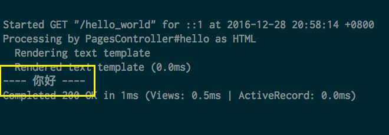
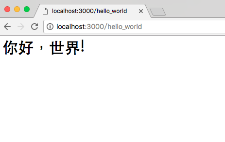
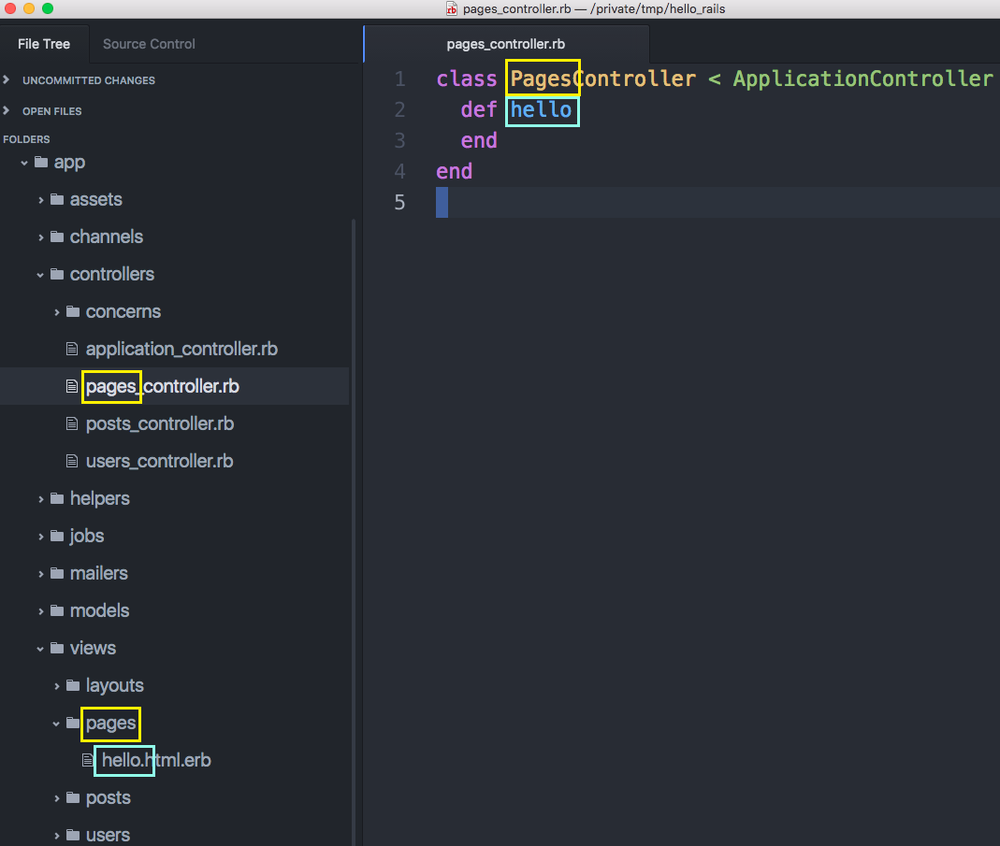
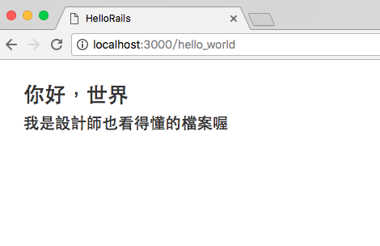
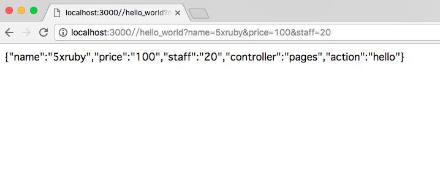
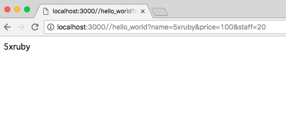
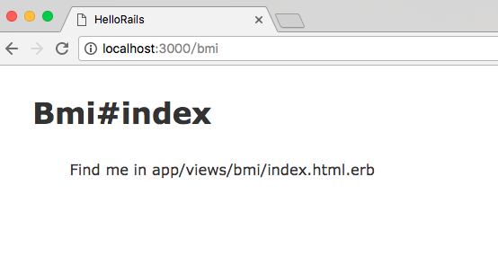
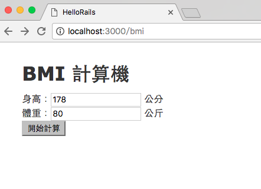
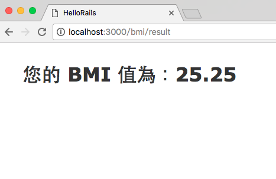

# Controller

- [向你的用戶說聲哈囉](#say-hello-world)
- [Params 變數](#params)
- [實作練習：BMI 計算器](#bmi-calculator)

## <a name="say-hello-world"></a> 向你的用戶說聲哈囉

接續前一章，Route 解讀網址之後，會把工作轉往指定的 Controller 及 Action。在這個小節我們會試著在畫面上跟使用者說聲哈囉，熟悉一下 Route、Controller 以及 View 是怎麼運作的。

### Controller 是幹嘛的

Controller 中文可翻譯成「控制器」，顧名思義，就是用來控制流程，例如它可能需要跟 Model 要資料，可能需要跟 View 要 HTML template 來玩填空遊戲，或是可能需要存取外部服務(例如金流串接)等，這大多是 Controller 要做的工作。

### 命名慣例

在 Rails 的慣例中，Controller 的命名會根據 Route 是使用複數的 `resources` 還是單數 `resource` 方法而定。如果在 Route 是使用複數型態，例如：

```ruby
Rails.application.routes.draw do
  resources :posts
  resources :users
end
```

在沒有特別指定 Resources 的 `controller` 參數的情況下，預設會對到的 Controller 就會是 `PostsController` 或是 `UsersController` 這樣的複數型態；反之，如果使用的是單數 `resource`，對到的就會是單數的 Controller。

### 第 0 步 - 新增 Controller

在開始之前，讓我們使用 Rails 內建的產生器做一個全新的 Controller：

    $ rails g controller pages
    Running via Spring preloader in process 16503
      create  app/controllers/pages_controller.rb
      invoke  erb
      create    app/views/pages
      invoke  test_unit
      create    test/controllers/pages_controller_test.rb
      invoke  helper
      create    app/helpers/pages_helper.rb
      invoke    test_unit
      invoke  assets
      invoke    coffee
      create      app/assets/javascripts/pages.coffee
      invoke    scss
      create      app/assets/stylesheets/pages.scss## <a name="render"></a>頁面輸出

上面這行指令會幫你做出一個 `PagesController`，以及一些其它對應的檔案、目錄。Controller 的內容如下：

```ruby
class PagesController < ApplicationController
end
```

這個 Controller 裡什麼內容都沒有，就只有繼承自 `ApplicationController` 而已。所以如果之後上手的話，也不一定要用產生器來幫你產生 Controller，直接自己手動新增也行。

### 第 1 步 - 新增 Route

別忘了，使用者想要看到你網站上的內容，第一步是要問過 Route，所以我們先在 Route 上簡單的加上一條：

```ruby
Rails.application.routes.draw do
  get "hello_world", to: "pages#hello"

  resources :posts
  resources :users
end
```

當使用者輸入 `/hello_world` 網址的時候，會交給 `PagesController` 的 `hello` 方法處理。(是的，其實網址跟 Controller 上的 Action 不一定要同名喔)

### 第 2 步 - 把文字印出來吧!

有了 Route 之後，接下來回到 Controller 把 `hello` 這個 Action 加上去：

```ruby
class PagesController < ApplicationController
  def hello
    render plain: "<h1>你好，世界!</h1>"
  end
end
```

在 `hello` 方法裡要把文字輸出到瀏覽器上，不是使用 `return` 也不是使用 `puts`，而是使用 `render` 方法，後面的 `plain` 參數是指要輸出一個一般的文字內容到畫面上。

有些剛開始學 Rails 的新朋友可能會這樣想：

```ruby
class PagesController < ApplicationController
  def hello
    render plain: "<h1>你好，世界!</h1>"
    puts "---- 你好 ----"
  end
end
```

使用 `puts` 方法把資料直接輸出在畫面上，看起來很直覺，但這樣不會有效果。事實上並不是 `puts` 方法不能用，它的確可以把東西印出來，只是不是印在瀏覽器上給你看到，而是印在 Rails 的 log 裡，仔細看一下正在執行 `rails server` 的那個畫面是不是有這樣的東西：



你就可以看到這樣的畫面：



### 第 3 步 - 把工作交給 View 吧

雖然第 2 步這樣可以把資料輸出在畫面上沒錯，但這樣實在是太辛苦了。在 Controller 裡的 Action，如果沒有特別指定 `render` 方法的話，它會到 `app/views/` 的目錄找「 Controller 名字」目錄裡的 Action 同名檔案。以這個例子來說，它會去找 `app/views/pages/hello.html.erb`。



如果這個 `hello.html.erb` 不存在，就自己手動建一個吧。即然輸出的事情交給 View，原來 `hello` 這個 Action 的 `render` 方法就可以拿掉：

```ruby
class PagesController < ApplicationController
  def hello
  end
end
```

就這樣空空的，然後編輯 `app/views/pages/hello.html.erb`

```erb
<h1>你好，世界</h1>
<h2>我是設計師也看得懂的檔案喔</h2>
```

重新整理，應該就會看到跟剛才的差別：



這樣的好處是不用把 HTML 都寫在 Controller 裡(事實上也很少人會這麼做)，再來就是要跟設計師合作的時候也比較方便。

## <a name="params"></a>Params 參數

接下來我們看看怎麼傳參數給 Controller。當使用者輸入網址這樣的網址：

    /hello_world?name=5xruby&price=100&staff=20

畫面的輸出雖然沒變，但後面跟的那串東西會被當做參數傳進一個特別的變數叫做 `params`。這是 Rails 預先幫我們定義好的，它可以捕捉到這個頁面的資訊。讓我們在剛剛的 `hello` Action 裡加一些料：


```ruby
class PagesController < ApplicationController
  def hello
    render json: params
  end
end
```

使用 `render` 方法，把 `params` 這個變數用 `JSON` 的方式印出來，可以看到這個結果：



Rails 會把剛剛後面那串東西，整理成一個類似 Hash 的東西，例如我只想要 `name` 參數的話：

```ruby
class PagesController < ApplicationController
  def hello
    render plain: params["name"]
  end
end
```



不管是 GET 或是 POST 方式傳過來的參數，都會被收集到這個 `params` 裡。

## <a name="bmi-calculator"></a>實作練習：BMI 計算器

大概知道 Route、Controller、View 以及 Params 的使用方法後，接下來我們來做一個可以計算 BMI(Body Mass Index，身體質量指數)的計算機。

### 第 0 步 - 新增 Controller 及 Route

先用產生器把 Controller 做出來：

    $ rails g controller bmi index                                                                                                                                                                            21:53:32
    Running via Spring preloader in process 18198
     create  app/controllers/bmi_controller.rb
      route  get 'bmi/index'
     invoke  erb
     create    app/views/bmi
     create    app/views/bmi/index.html.erb
     invoke  test_unit
     create    test/controllers/bmi_controller_test.rb
     invoke  helper
     create    app/helpers/bmi_helper.rb
     invoke    test_unit
     invoke  assets
     invoke    coffee
     create      app/assets/javascripts/bmi.coffee
     invoke    scss
     create      app/assets/stylesheets/bmi.scss


跟前面稍微有點不一樣的是在 Controller 後面多加了 `index` 這個參數，這樣會自動幫你做幾件事：

#### 1 - 幫你加上 Route

```ruby
Rails.application.routes.draw do
  get 'bmi/index'

  get "hello_world", to: "pages#hello"
  resources :posts
  resources :users
end
```

多加了 `get 'bmi/index` 條路徑。但我不是很喜歡這樣的路徑，所以請把它改成：

```ruby
Rails.application.routes.draw do
  get "bmi", to: "bmi#index"

  get "hello_world", to: "pages#hello"
  resources :posts
  resources :users
end
```

這時候輸入路徑 `/bmi` 應該可以看到這個畫面：



#### 2 - 自動幫 Controller 加上 `index` Action：

```ruby
class BmiController < ApplicationController
  def index
  end
end
```

#### 3 - 自動幫你產生 `app/views/bmi/index.html.erb` 檔案

內容如下：

```erb
<h1>Bmi#index</h1>
<p>Find me in app/views/bmi/index.html.erb</p>
```

### 第 1 步 - 建立表單

編輯 `app/views/bmi/index.html.erb` 如下：

```erb
<h1>BMI 計算機</h1>

<%= form_tag '/bmi/result' do %>
  身高：<%= text_field_tag 'body_height' %> 公分<br />
  體重：<%= text_field_tag 'body_weight' %> 公斤<br />
  <%= submit_tag "開始計算" %>
<% end %>
```

這裡有幾個需要稍做說明的地方：
1. `form_tag` 會被轉換成 HTML 的 `<form>` 標籤
2. `text_field_tag` 會被轉換成 HTML 的 `<input type="text" />` 標籤。
3. `submit_tag` 會被轉換成 HTML 的 `<input type="submit" />` 標籤。

以上這些方法都統稱為 `View Helper`，更多相關的使用方法參考[這裡](http://api.rubyonrails.org/classes/ActionView/Helpers/FormTagHelper.html)。詳細轉換內容可直接檢視頁面原始碼。這時候的畫面會長得像這樣：


### 第 2 步 - 新增 Route

這時候當我們按下送出的時候會得到 `Routing Error` 的錯誤訊息，那是因為我們還沒有這個路徑，所以現在來補做一下。在 Route 裡加上一行：

```ruby
Rails.application.routes.draw do
  get "bmi", to: "bmi#index"
  post "bmi/result", to: "bmi#result"

  get "hello_world", to: "pages#hello"
  resources :posts
  resources :users
end
```

這樣可讓 Route 可以接到 `POST` 並轉往 `BmiController` 的 `result` Action。

### 第 3 步 - 計算

Route 有了，接下來就是把 `result` Action 的內容補上去：

```ruby
class BmiController < ApplicationController
  def index
  end

  def result
    height = params[:body_height].to_f / 100   # 把單位換算成公尺
    weight = params[:body_weight].to_f

    # BMI 計算公式: BMI = 體重(單位：公斤) / 身高平方(單位：公尺).
    @bmi = (weight / (height * height)).round(2)
  end
end
```

BMI 的計算公式還滿單純的，不過要注意的是：

1. 透過 `params` 取得的資料預設型態是字串，所以需要使用 `.to_i` 或 `.to_f` 轉換成數字。這裡因為需要使用除法計算到小數點以下所以使用 `.to_f` 方法進行轉換。
2. 計算完的結果存成實體變數 `@bmi`，以便讓 View 可以取用。

### 第 4 步 - 呈現結果

最後一步，把結果印出來。編輯檔案 `app/views/bmi/result.html.erb` (如果檔案不存在請直接手動建立)：

```erb
<h1>您的 BMI 值為：<%= @bmi %></h1>
```

搞定!  試玩一下，我輸入身高 178 公分、體重 80 公斤：



按下送出即可得到計算結果：



## 小結

雖然這個計算機的功能相當陽春，而且也很多地方需要改善，例如防呆機制，或是根據計算結果嘲諷一下 BMI 值過高的胖子。但如果你能理解這個例子裡 Route、Controller、View 之間的基本運作原理，當下回遇到更複雜的應用程式開發相信也是可以迎刃而解。

