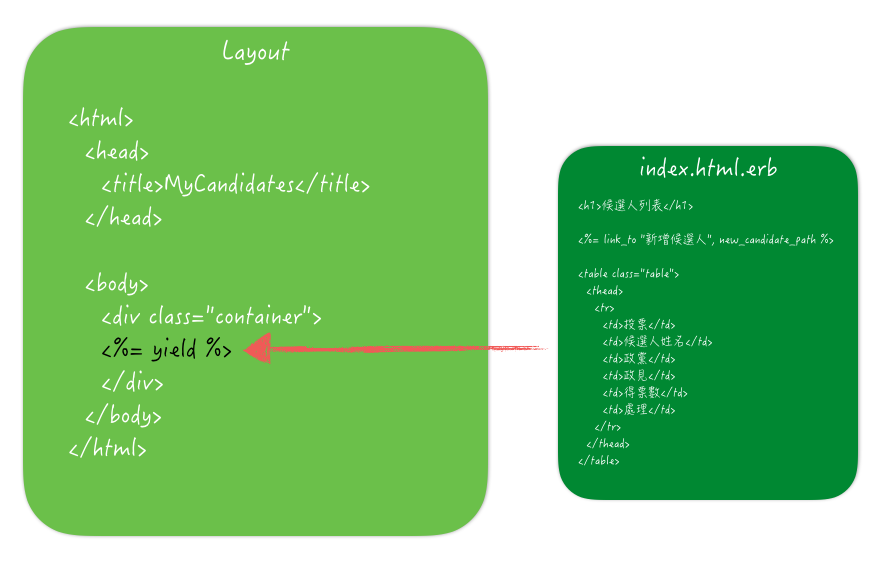
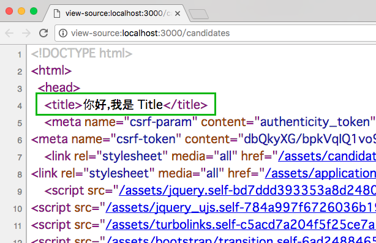
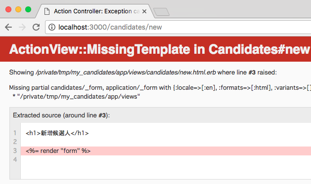
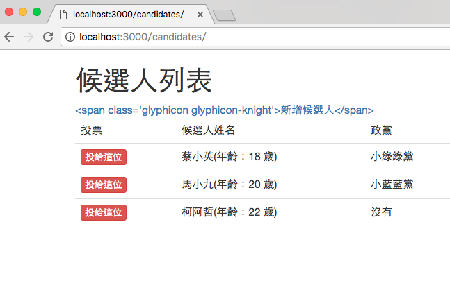
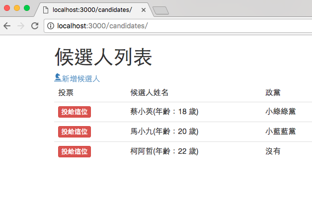

# Layout, Render 與 View Helper

- [版型 (Layout)](#layout)
- [局部渲染 (Partial Render)](#partial-render)
- [View Helper](#view-helper)

在上個章節介紹了 CRUD 的分解動作，接下來這個章節要介紹的是在 Rails 專案 MVC 架構的 V。

## <a name="layout"></a>版型 Layout

隨便打開一個在 `app/views` 目錄裡的檔案，例如上個章節的候選人列表頁面：

```erb
<h1>候選人列表</h1>

<%= link_to "新增候選人", new_candidate_path %>

<table class="table">
  <thead>
    <tr>
      <td>投票</td>
      ...[略]...
      <td>
        <%= link_to "編輯", edit_candidate_path(candidate) %>
        <%= link_to "刪除", candidate_path(candidate), method: "delete", data: { confirm: "確認刪除" } %>
      </td>
    </tr>
    <% end %>
  </tbody>
</table>
```

在這個檔案裡，看不到任何 `<html>`、`<title>` 或 `<body>` 之類的 HTML 標籤，但檢視實際網頁的原始碼又都有，這是怎麼回事呢?

### yield

以這個例子來說，Controller 在處理 View 的時候，並不只是單純的只取用 `index.html.erb`，而是會先取用 Layout 檔案的內容(預設是 `app/views/layouts/application.html.erb`)，然後把 `index.html.erb` 的內容填到 `<%= yield %>` 裡。



版型的好處，就是不需要重複的寫一堆長得一樣的 HTML 標籤，例如頁面的頁首跟頁尾通常不會有什麼變化，這種就是版型適用的地方。

讓我們看一下 `app/views/layouts/application.html.erb` 的內容：

```erb
<!DOCTYPE html>
<html>
  <head>
    <title>MyCandidates</title>
    <%= csrf_meta_tags %>
    <%= stylesheet_link_tag    'application', media: 'all', 'data-turbolinks-track': 'reload' %>
    <%= javascript_include_tag 'application', 'data-turbolinks-track': 'reload' %>
  </head>

  <body>
    <div class="container">
    <%= yield %>
    </div>
  </body>
</html>
```

這裡有幾行需要說明一下：

1. `csrf_meta_tags` 方法會在頁面上產生 `<csrf-param>` 跟 `<csrf-token>` 兩個 `<meta>` 標籤，用途主要是確保網站較不容易受到 CSRF (Cross-site request forgery) 攻擊。
2. `stylesheet_link_tag` 方法會轉換成 CSS 的 `<link rel="stylesheet">` 標籤。
3. `javascript_include_tag` 方法會轉換成 JavaScript 的 `<script>` 標籤。

### CSRF 攻擊?

CSRF (Cross-site request forgery) 中文翻譯成「跨站請求偽造」。通常 CSRF 攻擊的目的不一定是直接獲取使用者帳戶的控制權或個資，但可以用其它使用者的名義執行某些操作。

舉個例子來說，假設我想攻擊某個 Blog 平台，我可能可以猜到後台的路徑，例如對 `/admin/posts/2` 路徑發送 `DELETE` 方法，就可以刪除編號 2 號的文章。雖然我沒有這個網站後台的使用權限，但我知道 A 先生有，所以我就假裝寄一封「恭喜你，你得到了 iphone 7」的信件給 A 先生，但事實上這個連結點下去就是會對 `/admin/posts/2` 網址發送 `DELETE`，這樣那篇文章就藉由 A 先生的權限被刪除了!

### 只能一個版型嗎?

如果你喜歡，可以有多種款式的版型，預設的版型是 `app/views/layouts/application.html.erb`。例如我想要增加一款後台專用的版型，可以在 `app/views/layouts/` 目錄下新增一個 `backend.html.erb`，內容如下：

```erb
<!DOCTYPE html>
<html>
  <head>
    <title>網站管理系統</title>
    <%= csrf_meta_tags %>
    <%= stylesheet_link_tag 'application', media: 'all', 'data-turbolinks-track': 'reload' %>
    <%= javascript_include_tag 'application', 'data-turbolinks-track': 'reload' %>
  </head>

  <body>
    <h1>我是後台</h1>
    <div class="container">
      <%= yield %>
    </div>
  </body>
</html>
```

要套用版型有幾種用法：

#### 1. 整個 controller 都套用同一個版型

在 Controller 裡使用 `layout` 方法：

```ruby
class CandidatesController < ApplicationController
  layout "backend"

  # ...[略]...
end
```

這樣整個 Controller 的頁面在處理的時候就都會套用 `backend` 版型了。

#### 2. 只有某個 Action 套某個版型

在特定 Action 裡使用 `render` 方法：

```ruby
class CandidatesController < ApplicationController

  def index
    @candidates = Candidate.all
    render layout: "backend"
  end

  # ...[略]...
end
```

這樣就只有這個 `index` 的頁面會套用 `backend` 版型，其它沒特別交待的還是會用預設版型。

#### 3. 如果都不要?

如果因為某些原因，完全不想套任何版型，在 Controller 可以這樣寫：

```ruby
class CandidatesController < ApplicationController
  layout false

  # ...[略]...
end
```

在特定 Action 可以這樣：

```ruby
class CandidatesController < ApplicationController

  def index
    @candidates = Candidate.all
    render layout: false
  end

  # ...[略]...
end
```

### 預設版型?

前面提到說預設的版型是 `app/views/layouts/application.html.erb`，這句話其實不完全正確。真正的預設版型應該是「跟 Controller 同名」的版型。

舉例來說，有個 Controller 叫做 `CandidatesController`，它的版型檔案其實是會先到 `app/views/layouts/` 目錄下找 `candidates.html.erb` 檔案，如果找不到才換找 `application.html.erb`。

### 只能一個 yield 嗎?

這個 `yield` 就是用來填空的坑，不一定只有一個，想要的話也可以有很多個，而且還可以幫這些坑標記名字：

```erb
<!DOCTYPE html>
<html>
  <head>
    <title><%= yield :my_title %></title>
    <%= csrf_meta_tags %>
    <%= stylesheet_link_tag 'application', media: 'all', 'data-turbolinks-track': 'reload' %>
    <%= javascript_include_tag 'application', 'data-turbolinks-track': 'reload' %>
  </head>

  <body>
    <div class="container">
    <%= yield %>
    </div>
  </body>
</html>
```

除了原本的 `<%= yield %>` 之外，另外在 `<title>` 標籤裡加上 `<%= yield :my_title %>`，意思就是把這個坑標記成 `my_title`。要填這個指定名字的坑的話，有兩種做法：

#### 使用 provide

你可以使用 `provide` 方法，指定要幫 `my_title` 提供資料：

```erb
<% provide :my_title, "你好，我是 Title" %>

<h1>候選人列表</h1>

<%= link_to "新增候選人", new_candidate_path %>

<table class="table">
  <thead>
    <tr>
      <td>投票</td>
      <td>候選人姓名</td>
...[略]...
```

#### 使用 content_for

或是使用 `content_for` 來填坑：

```erb
<% content_for :my_title do %>
你好，我是 Title
<% end %>

<h1>候選人列表</h1>

<%= link_to "新增候選人", new_candidate_path %>

<table class="table">
  <thead>
    <tr>
      <td>投票</td>
      <td>候選人姓名</td>
...[略]...
```

不管哪一種方式都可以，檢視原始碼就可以發現填坑的效果了：



## <a name="partial-render"></a>局部渲染 (Partial Render)

局部渲染是一種在 Rails 專案很常見的程式碼整理手法之一。在前一個章節整理表單的時候，有用到了這樣的寫法：

```erb
<%= render "form" %>
```

其實完整的寫法是這樣寫：

```erb
<%= render partial: "form" %>
```

但用前面簡單的寫法在這邊也是可以的。這行的意思是會去同一個目錄找 `_form` 這個檔案，並且把檔案內容安插在這個地方。注意這個檔案必需要是底線開頭的，否則會出現 `ActionView::MissingTemplate` 的錯誤訊息：



通常局部渲染適用於「可以重複使用」的程式碼，像是在上個章節的表單就是一例。

### 較好的設計

雖然 `<%= render "form" %>` 這樣短短一行很容易用，但這樣不見得是個好的設計。一個容易重複使用的局部樣版，不應該依類滿天飛的實體變數。舉個例子來說，如果想要做一個叫做橫幅廣告的局部樣版，可能會這樣寫(檔案名稱 `_banner.html.erb`)：

```erb
<div class="advertisement">
  <div>廣告</div>
  <div> <%= @content %> </div>
</div>
```

使用的時候這樣用：

```erb
<%= render "banner" %>
```

也就是說，這個 `_banner.html.erb` 會自己去空氣中抓看看有沒有 `@content` 這個實體變數給它，有的話就印出來。但事實上不是每個頁面都有這東西可以抓，所以不見得容易重複使用。比較建議的設計會是這樣：

```erb
<div class="advertisement">
  <div>廣告</div>
  <div> <%= content %> </div>
</div>
```

讓這個局部樣版裡只有一般的區域變數，然後在使用它的時候，把值傳主動傳給它：

```erb
<%= render partial: "banner", locals: {content: "我是廣告的內容"} %>
```

這個局部樣版就會得到一個 `content` 的區域變數。這樣做似乎變得之前更麻煩，但這樣的設計可以讓這個局部樣版變得更像一個「元件」，它會被動的等著你餵它資料，而不是自己伸手去空中抓，這樣一來不管在哪個頁面都可適用。

> 注意：這樣的寫法 `partial` 就不能省略了。

### 魔術 render

在上一章的「候選人列表」的程式碼中，中間有一段 `each` 迴圈，不斷的印出資料，這段如果使用局部樣版來整理的話，可以改成這樣：

```erb
<h1>候選人列表</h1>
...[略]...
  <tbody>
    <%= render partial: "candidate" %>
  </tbody>
</table>
```

所以，在 `app/views/candidates` 目錄底下應該可以預期有個 `_candidate.html.erb`：

```erb
<% @candidates.each do |candidate| %>
<tr>
  <td><%= link_to "投給這位", vote_candidate_path(candidate), method: "post", data: { confirm: "確認要投給這位候選人嗎?!" }, class:"btn btn-danger btn-xs" %></td>
  <td><%= candidate.name %>(年齡：<%= candidate.age %> 歲)</td>
  <td><%= candidate.party %></td>
  <td><%= candidate.politics %></td>
  <td><%= candidate.votes %></td>
  <td>
    <%= link_to "編輯", edit_candidate_path(candidate) %>
    <%= link_to "刪除", candidate_path(candidate), method: "delete", data: { confirm: "確認刪除" } %>
  </td>
</tr>
<% end %>
```

這感覺沒什麼了不起的，就是把原來的內容整個剪到另一個局部樣版裡而已，它需要的 `@candidates` 實體變數也還是自己往空中抓，前面才剛講這樣不是好的設計。的確，如果只是這樣的話其實也不需要做了。Rails 針對這樣的用法，有加了一個 `collection` 的參數：

```erb
<%= render partial: "candidate", collection: @candidates %>
```

然後 `_candidate.html.erb` 檔案的內容可以把外層的 `each` 迴圈拿掉，變成這樣：

```erb
<tr>
  <td><%= link_to "投給這位", vote_candidate_path(candidate), method: "post", data: { confirm: "確認要投給這位候選人嗎?!" }, class:"btn btn-danger btn-xs" %></td>
  <td><%= candidate.name %>(年齡：<%= candidate.age %> 歲)</td>
  <td><%= candidate.party %></td>
  <td><%= candidate.politics %></td>
  <td><%= candidate.votes %></td>
  <td>
    <%= link_to "編輯", edit_candidate_path(candidate) %>
    <%= link_to "刪除", candidate_path(candidate), method: "delete", data: { confirm: "確認刪除" } %>
  </td>
</tr>
```

因為傳了 `collection` 參數的關係，在局部樣版裡即使拿掉了 `each` 迴圈，它還是可以正常運作，而且呈現的畫面還是跟原來的一樣。這樣一來，在 `_candidate.html.erb` 檔案裡的都只剩區域變數，不需要再依賴空中的實體變數。

還可以再短一點，把這一行：

```erb
<%= render partial: "candidate", collection: @candidates %>
```

直接改成這樣：

```erb
<%= render @candidates %>
```

`_candidate.html.erb` 檔案不需要改，整個還是可以正常運作。短短一行，而且還不用寫迴圈就可以達到跟原來用 `each` 迴圈一樣的效果，很神奇吧!

但這樣的寫法其實有點過於魔術，而且依賴不少 Rails 裡的「慣例」，如果要讓 ``<%= render @candidates %>` 可以正常運作的話，需要：

1. 局部樣版的檔名必須是那包資料的「單數」，而且放在對的位置，例如檔名必需是 `_candidate.html.erb`，而且放在 `app/views/candidates` 裡。
2. 局部樣版裡不需要寫迴圈(寫了反而會多跑一層迴圈)，裡面用到的區域變數必須是單數，例如 `candidate`。

如果沒有按照這些慣例就會出現錯誤訊息。

## <a name="view-helper"></a>View Helper

除了上面提到的局部樣版，View Helper 也是用來整理程式碼很常用的手法。其實平常大家在寫的 `link_to`、`image_tag` 或是 `form_for`，它都是一種 View Helper。

雖然 View Helper 通常是寫在 View 的 HTML 標籤裡，但其實 View Helper 本身是標準的 Ruby 程式碼，使用起來就跟在呼叫一般的 Ruby 方法一樣。

### 自定 View Helper

除了 Rails 內建的方法，有時候在專案中也會寫一些自己會用的方法，例如可能有一段程式碼長這樣：

```erb
<tr>
  <td>
    <% if gender == 1 %>
      男
    <% elsif gender == 0 %>
      女
    <% else %>
      不想說
    <% end %>
  </td>
</tr>
```

當 `gender` 的值是 1 的時候印出 `男`，是 0 的時候就印出 `女`，不然就印出 `不想說`。雖然像這樣的寫法很簡單也很直覺，但這樣就會讓 View 開始有一些邏輯判斷了，這不是好事。View 的主要用途是輸出結果在畫面上，邏輯判斷越少越好。像上面這個例子，我們就可以把這段 `if .. else` 判斷，搬到 View Helper 放著。

View Helper 主要是放在 `app/helpers` 目錄裡。要寫在哪個檔案裡都可以(因為所有的 View Helper 都可以被 Rails 載入)，但通常會放在跟功能有關的檔案裡。這裡我直接先放在 `app/helpers/application_helper.rb` 裡面：

```ruby
module ApplicationHelper
  def user_gender(gender)
    if gender == 1
      "男"
    else
      "女"
    end
  end
end
```

View Helper 是定義在模組裡，Rails 在啟動的時候會把這些 Helper 都 include 進來，讓大家在 View 可以開心使用。如上面這個例子，我在 `ApplicationHelper` 這個模組裡定義了一個 `user_gender` 方法，這個方法可以接收一個參數，並根據參數的內容回傳「男」或「女」。然後原來在 View 的那段邏輯判斷就可以改成這樣：

```erb
<tr>
  <td><%= user_gender(gender) %></td>
</tr>
```

讓 View 的程式碼變得乾淨又清楚。

### 讓原本的 Helper 更好用

其實內建的 View Helper 很好用，但偶爾會有另外再加一些料，像是想要在 `link_to` 超連結的前面加上一個小 icon，你可能會這樣寫：

```erb
<h1>候選人列表</h1>

<%= link_to "<span class='glyphicon glyphicon-knight'>新增候選人</span>", new_candidate_path %>
```

結果你會得到這樣的畫面：



`link_to` 方法把 HTML 標籤「完整」的呈現在畫面上了，這應該不是你想要的! 這是因為 `link_to` 後面接的那個字串會自動被逸出(escape)，除非你使用 `.html_safe` 方法，主動告訴它說「這個字串是安全的」：

```erb
<h1>候選人列表</h1>

<%= link_to "<span class='glyphicon glyphicon-knight'>新增候選人</span>".html_safe, new_candidate_path %>
```

這樣就會正常了：



但這樣看起來有點囉嗦，所以如果這樣的寫法常用的話，我會建議把它包成 Helper：

```ruby
module ApplicationHelper
  def icon_link_to(label, path, icon)
    link_to path do
      content_tag :span, class: "glyphicon glyphicon-#{icon}" do
        label
      end
    end
  end
end
```

在自己定義的這個 `icon_link_to` 方法裡，除了使用了原本的 `link_to` 之外，也再加上 `content_tag` 這個內建的 Helper 來包標籤，好處是這樣就不需要自己再加 `.html_safe` 了。原來的 View 就可以這個剛寫好的 `icon_link_to` 方法：

```erb
<h1>候選人列表</h1>

<%= icon_link_to "新增候選人", new_candidate_path, "knight" %>
```

除了看起來比原來的 `link_to` 簡單、乾淨外，在全站每個有需要的 icon 的連結也都可以使用，相當便利。

