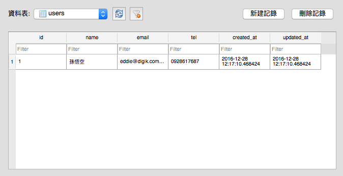

# Model 基本操作

- [基本觀念](#basic)
- [Model 基本操作](#model-crud)

前面介紹過 Rails 的 MVC 架構的 V 跟 C，接下來的幾個章節將主要介紹 M。

## <a name="basic"></a>基本觀念

### Model 是什麼?

很多剛開始接觸 Rails 的 MVC 架構的新手，可能會認為 Model 就是資料庫，事實上並不是。請先記住一件很很重要的觀念：

> Model 不是資料表(Table)，Model 只是疊在資料表上面的一個抽象類別，負責跟實體的資料表溝通。

打個比方，Model 的角色有點類似卡通「哆啦 A 夢」裡有種叫做「翻譯蒟蒻」的道具，我們跟 Model 說人話，Model 會幫我們翻譯成資料庫看得懂的話(SQL)，幫我們跟資料庫要資料。

### Model 跟與資料表(Table)的關係

講到 Model 跟資料表的關係，剛開始學習 Rails 的新手常會認為一個 Model 就會對到一個資料表，一個資料表就一定也有一個對應的 Model。在比較單純的專案，Model 跟資料表通常的確是一對一沒錯，但這並不是絕對的。

### 慣例 - 資料表命名

在 Rails 專案中，Model 的命名是單數(而且必須大寫，因為在 Ruby 的類別名稱必須是大寫)，而資料表的命名則是複數(因為可以放很多資料?)、小寫並以底線分隔。

| Model 名稱 | 表格名稱    |
|------------|-------------|
| User       | users       |
| Category   | categories  |
| OrderItem  | order_items |

這是 Rails 的預設慣例，通常這些事不用我們特別煩惱，因為在 Rails 的 Model 產生器在幫我們產生 Migration 的時候，都會自動幫我們依照慣例設定表格名稱。但如果一些其它因素要修改，可在 Model 加上 `table_name` 方法來調整。例如有一個叫做 `User` 的 Model，但希望對到的資料表名字叫做 `accounts`：

```ruby
class User < ActiveRecord::Base
  self.table_name = "accounts"
end
```

只是，在 Rails 中我們會儘量遵守「慣例優於設定」(CoC, Convention over Configuration)的原則，順著預設的慣例做，可以省下不少麻煩。

### 慣例 - 流水編號與時間戳記

讓我們看一下這個 Migration 檔的內容：

```ruby
class CreateUsers < ActiveRecord::Migration[5.0]
  def change
    create_table :users do |t|
      t.string :name
      t.string :email
      t.string :tel

      t.timestamps
    end
  end
end
```

大概猜得出來它會有 `name`、`email` 以及 `tel` 三個欄位，執行 Migration 之後，如果使用資料庫檢視工具(我使用的是[DB Browser for SQLite](http://sqlitebrowser.org/))看一下這個資料表的樣子：



會發現除了上面這三個欄位之外，還多了 `id`、`created_at` 跟 `updated_at` 三個欄位。事實上，在 Migration 檔案中的 `t.timestapms` ，在經過轉換之後，會產生兩個名為 `created_at` 跟 `updated_at` 的時間欄位，分別會在資料「新增」及「更新」的時候，把當下的時間寫進去。

而 `id` 欄位你在 Migration 沒看到任何資訊，這是 Rails 自動幫每個資料表加的流水編號欄位。

### PORO

PORO 是 Plain Old Ruby Object

## <a name="model-crud"></a>Model 基本操作

### 什麼是 ORM?

ORM 是 Object Relational Mapping 的縮寫，中文翻譯成物件關係對映。我們如果想要存取資料庫裡的內容，以前必需透過資料庫查詢語言(SQL)向資料庫進行查詢，但透過 ORM 的包裝之後，可以讓我們用操作「物件」的方式來操作資料庫。例如如果我想要找出所有 `users` 資料表裡的資料：

```ruby
User.all
```

透過轉換之後會變成：

```sql
select * from users`
```

### CRUD 之 C (Create)

要新增一筆資料，常見有 `new` 跟 `create` 兩種方式。使用 `new` 方法做出一個 Model 物件後，再執行 `save` 方法即可把該筆資料存入資料表：

```ruby
user = Candidate.new(name: "孫悟空", age: 18)
user.save
```

另外使用 `create` 也可新增資料，但不需要執行 `save` 方法即可寫入資料表：

```ruby
Candidate.create(name: "孫悟空", age: 18)
```

`new` 跟 `create` 的差別，就是 `new` 方法只是先把物件做出來，尚未存入資料表，而 `create` 方法則是直接把存入資料表。不管是 `new` 或 `create`，在寫入失敗的時候都會回傳一個「內容都是 nil 的 Model 物件」，通常在 Controller 的 Action 裡常會藉此判定資料寫入是否成功：

```ruby
class PostsController < ApplicationController
  # ...[略]...

  def create
    @post = Post.new(post_params)
    if @post.save
      redirect_to @post, notice: 'Post was successfully created.'
    else
      render :new
    end
  end
end
```

另外，`create` 有另一個叫做 `create!` 的兄弟(沒錯，就是後面加了驚嘆號版本的)，它跟 `create` 一樣會把資料直接寫入資料表，但差別是當寫入發生錯誤時，它會產生例外(Exception)訊息。

### CRUD 之 R (Read)

從資料表裡讀取資料也是很常見的操作，在讀取的方法就比寫入來得多樣化，有一次讀取一筆的方法，也有一次讀取一整批的方法。

#### first & last

想要取得資料表中的第一筆或最後一筆資料，可使用 `first` 或 `last` 方法：
```ruby
user = Candidate.first        # 取得第 1 筆資料
users = Candidate.first(3)    # 取出前 3 筆資料並存放在陣列裡
```

要注意的是，`first` 本身只會取出 1 筆資料，而 `first(3)` 雖然是取出前 3 筆資料，但會放在一個陣列裡。Model 預設使用 `id` 流水編號做為排序，所以如果想要反過來，可以用連續技：

```ruby
Candidate.order(age: :desc).first    # 取出年紀最大的候選人
```

#### find & find_by

如果想要找到指定 id 的候選人，可使用 `find` 或 `find_by` 方法：

```ruby
Candidate.find(1)
Candidate.find_by(id: 1)
```

這兩種方式都可以找到編號是 1 號的候選人。差別是 `find_by` 方法如果找不到指定 id 的資料，僅會回傳 `nil`，但 `find` 方法會直接產生 `ActiveRecord::RecordNotFound` 的錯誤訊息：

    >> Candidate.find_by(id: 9487)
      Candidate Load (0.1ms)  SELECT  "candidates".* FROM "candidates" WHERE "candidates"."id" = ? LIMIT ?  [["id", 9487], ["LIMIT", 1]]
    => nil

    >> Candidate.find(9487)
      Candidate Load (0.2ms)  SELECT  "candidates".* FROM "candidates" WHERE "candidates"."id" = ? LIMIT ?  [["id", 9487], ["LIMIT", 1]]
    ActiveRecord::RecordNotFound: Couldn't find Candidate with 'id'=9487
      ...[略]...

#### all, where, order, limit

使用 `all` 方法可取得所有資料，取得資料將存放在陣列裡：

```ruby
Candidate.all
```

`where` 方法則會再加上一些條件做為篩選：

```ruby
Candidate.where("age > 18", gender: "female")
```

這樣可取得「女性且大於 18 歲」的候選人。如果要分開兩段寫也是可以：

```ruby
Candidate.where("age > 18").where(gender: "female")
```

結果也是一樣的。另外，使用 `order` 方法可對資料做排序：

```ruby
Candidate.order(:age)         # 按照年齡大小，預設是由小排到大
Candidate.order(age: :desc)   # 按照年齡大小，由大排到小
```

如果想要限制取得筆數，則是使用 `limit` 方法：

```ruby
Candidate.order(age: :desc).limit(3)
```

這樣即可取得「年齡最大的三個候選人」的資料

### CRUD 之 U (Update)

更新資料常用的有 `save`、`update`、`update_attributes`、以及 `update_all` 方法：

```ruby
c1 = Candidate.find_by(id: 1)

# 使用 save 方法
c1.name = "剪彩倫"
c1.save

# 使用 update
c1.update(name: "剪彩倫", age: 20)

# 使用 update_attributes
c1.update_attributes(name: "剪彩倫", age: 20)

# 使用 update_all
Candidate.update_all(name: "剪彩倫", age: 18)
```

其中 `update_all` 要稍微注意一下，因為這個方法會把所有的候選人的名字及姓名都改成一樣。

### CRUD 之 D (Delete)

刪除資料就相對單純，可以使用 `delete`、`destroy` 或 `destroy_all` 方法：

```ruby
c1 = Candidate.find_by(id: 1)

# 把這筆資料刪除
c1.destroy
c1.delete

# 刪除編號是 1 號的資料
Candidate.delete(1)

# 刪除所有未成年的候選人
Candidate.destroy_all("age < 18")
```

