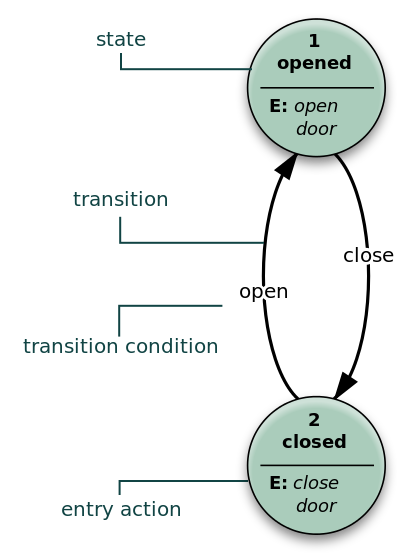

# 訂單處理

有了購物車功能，客人順利的下單、結帳，訂單也成立了，接下來就是訂單的處理了。

- [訂單要處理什麼?](#what-order-do)
- [有限狀態機](#state-machine)

## <a name="what-order-do"></a>訂單要處理什麼?

通常一筆訂單上面會有：

1. 商品(Product)資訊
2. 訂購數量(quantity)
3. 狀態

商品資訊跟訂購數量其實跟前一個章節購物車的 `CartItem` 的概念有點像，我們這裡要特別介紹的是訂單的「狀態」。訂單的狀態可以很單純也可以很複雜，雖然訂單的狀態欄位的資訊你可以選用字串來表示，但很多時候訂單狀態的改變，通常還會伴隨著一些變化。

另外，訂單狀態的變化也可能有多種變化，看一下這張圖：


雖然照正常流程來說，商品需要先「退貨」才能辦理「退款」，但如果是在狀態 2 的「已付款」，還沒來得及出貨結果客人就先按了退款，這時候也是一樣要進行退款流程；或是，商品要辦理退貨，理論上也是要等商品到貨才能退，但可能在運作的過程中客人就想退貨了，也是該要進行退貨流程。最重要的是，如果訂單是「待處理」狀態，它不應會被直接改成「已到貨」。

如果我們只是用單純的字串在做這個欄位的變化，然後程式裡面是直接修改這個欄位的內容，很容易造成訂單的靈異現像，例如明明還沒付錢的訂單卻被要求要退款。

## <a name="state-machine"></a>有限狀態機

有一個有趣的數學模型：[有限狀態機](https://zh.wikipedia.org/wiki/%E6%9C%89%E9%99%90%E7%8A%B6%E6%80%81%E6%9C%BA)，又簡稱「狀態機」，剛好可以解決我們上面提到的問題。



用平常每天大家都會經過的門當例子，狀態機就是「已經關上的門，只能打開不能關；已經打開的門，只能關不能打開」，或是開車為例：「在開車打檔的時候，應該是要 1 檔、2 檔、3 檔依續往上打，而不應該是在 4 檔突然打 P 檔」。

在狀態機的模型下，狀態理論上只能順著我們設計的路線走，所以不會有「待處理」的訂單突然就變成「已到貨」狀態的情況發生。

### 使用 AASM

如果要自己用 `if...else...` 來設計狀態機，那會非常的辛苦，而且不容易維護。還好有人做出一個叫做 [AASM](https://github.com/aasm/aasm) 的 gem 可以很快的幫我們做好這件事。

請把 `aasm` 放到 Gemfile 裡，別忘了執行 `bundle install` 以完成完裝。

### 訂單狀態

AASM 的使用方式滿單純的，假設我們有一個叫做 `Order` 的 Model，我們可以透過 AASM 提供的方法來定義可能發生的「狀態」：

```ruby
class Order < ApplicationRecord
  include AASM

  aasm do
    state :pending, initial: true
    state :paid, :shipping, :delivered, :returned, :refunded
  end
end
```

說明：

1. `state :pending, initial: true` 表示是這個 Model 的初始狀態
2. 存放狀態的欄位名稱預設叫做 `aasm_state`，型態是字串，但如果你的 Order Model 的狀態欄位不叫這個名字的話，要不可以透過 Migration 改個名字，或是直接這樣修改也可以：

```ruby
```ruby
class Order < ApplicationRecord
  include AASM

  aasm column: :state do
    state :pending, initial: true
    state :paid, :shipping, :delivered, :returned, :refunded
  end
end
```

如果你原來的狀態欄位叫 `state` 的話，這樣的修改就可以對得起來了。

### 定義事件

除了定義狀態之外，還能定義「事件」，基本上訂單的「狀態」都是由觸發「事件」而改變的，而不是直接修改狀態的內容：

```ruby
class Order < ApplicationRecord
  include AASM

  aasm do
    state :pending, initial: true
    state :paid, :shipping, :delivered, :returned, :refunded

    event :pay do
      transitions from: :pending, to: :paid
    end

    event :ship do
      transitions from: :paid, to: :shipping
    end

    event :delivering do
      transitions from: :shipping, to: :delivered
    end

    event :return do
      transitions from: [:delivered, :shipping], to: :returned
    end

    event :refund do
      transitions from: [:paid, :returned], to: :refunded
    end
  end
end
```

這裡訂義了 `pay`、`ship`、`delivering`、`return` 以及 `refund` 等事件，其中 `return` 跟 `refund` 事件可以在 2 個以上的不同的狀態觸發(例如在「已付款」跟「已退貨」都可以變成「已退款」)。

### 試用

進到 `rails console` 來試一下用起來的樣子吧：

    $ rails console
    >> o1 = Order.create
       (0.1ms)  begin transaction
      SQL (2.2ms)  INSERT INTO "orders" ("aasm_state", "created_at", "updated_at") VALUES (?, ?, ?)  [["aasm_state", "pending"], ["created_at", 2017-01-12 15:11:52 UTC], ["updated_at", 2017-01-12 15:11:52 UTC]]
       (0.7ms)  commit transaction
    => #<Order id: 7, product: nil, quantity: nil, aasm_state: "pending", created_at: "2017-01-12 15:11:52", updated_at: "2017-01-12 15:11:52">

使用 `Order.create` 先隨便建立一組訂單，你會發現這個訂單的狀態是 `pending`。接下來，AASM 有根據你定義的「狀態」送了一些好用的方法，例如：

    >> o1.pending?
    => true

問它目前是 `pending` 嗎? 它回答「是」

    >> o1.paid?
    => false

問它目前是不是已付款 `paid` 狀態嗎? 它說「不是」

    >> o1.may_pay?
    => true

繼續問它，請問這筆訂單現在可以付錢嗎? 它說「可以喔」

    >> o1.may_delivering?
    => false

那可以出貨嗎? 它說「不行」。這樣的回答相當合理，因為我們的設定中，沒付錢的訂單本來就不應該直接出貨。即然沒付錢，那現在讓我們觸發 `pay` 事件來付錢吧：

    >> o1.pay
    => true

這時候看一下這筆訂單的狀態：

    >> o1
    => #<Order id: 7, product: nil, quantity: nil, aasm_state: "paid", created_at: "2017-01-12 15:11:52", updated_at: "2017-01-12 15:11:52">

它的狀態度成 `paid` 了，再問問它的狀態：

    >> o1.pending?
    => false
    >> o1.paid?
    => true

回答都是正確的了。

你在這裡看到的一些問號方法以及 `may_` 方法，都是 AASM 在你定義狀態及事件的時候，自動送給你的，相當方便而且防呆。

如果想要在某個事件完成之後接著做另一件事，例如「退款之後發送簡訊通知購買人」，可以在事件裡面加上 `after` 方法：

```ruby
class Order < ApplicationRecord
  include AASM

  aasm do
    state :pending, initial: true
    state :paid, :shipping, :delivered, :returned, :refunded

    #...[略]...

    event :refund do
      transitions from: [:paid, :returned], to: :refunded

      after do
        # 發送簡訊通知...
      end
    end

  end
end
```

這樣就會在做完 `refund` 退款事件後，接著做 `after` 方法指定的事了。

更多詳細使用方法及 Callback，請見 [AASM](https://github.com/aasm/aasm) 的說明頁面。

