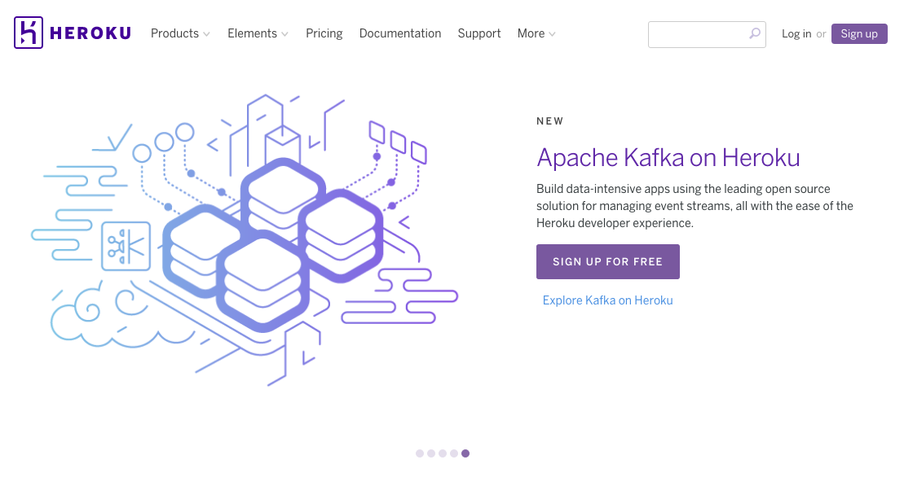
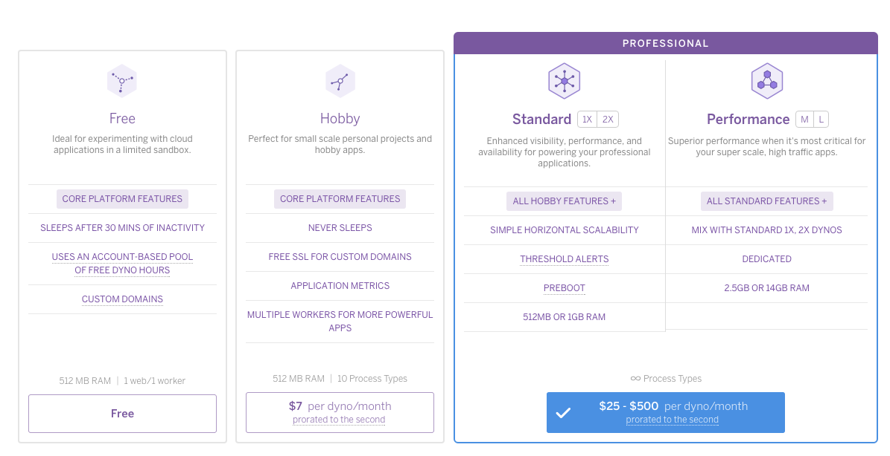

# 網站部署(使用 Heroku)

- [申請 Heroku 帳號](#sign-up-heroku)
- [安裝 Heroku Cli](#install-heroku-toolkit)
- [部署準備](#prepare-to-deploy)
- [推向 Heroku](#push-to-heroku)
- [使用 PostgreSQL 資料庫](#install-pg)
- [重新部署](#push-again)
- [小結](#note)

網站好不容易做好了，總不能老是在 localhost 孤芳自賞，該是把作品上傳到網路伺服器給大家欣賞一下了。

在目前眾多款式的雲端伺服器當中，Heroku 可能可以說是對 Ruby/Rails 專案最友善、部署最簡單的選擇。(畢竟 Ruby 的老爸松本行弘以及 Ruby 的前幾名重要的核心開發人員都在 Heroku 工作)

網址：https://www.heroku.com/



這個章節將介紹如何把 Rails 專案推上 Heroku。

## <a name="sign-up-heroku"></a>申請 Heroku 帳號

目前申請 Heroku 帳號是免費的，只要填寫一些簡單的基本資料即可申請。

## <a name="install-heroku-toolkit"></a>安裝 Heroku Cli

Heroku Cli 工具程式在好幾個平台上都有，請參考[這個頁面](https://devcenter.heroku.com/articles/heroku-cli)，找到自己適合的平台安裝。安裝完成後，在終端機環境下執行 `heroku login`，並輸入方才申請的帳號密碼：

    $ heroku login
    Enter your Heroku credentials.
    Email: eddie@digik.com.tw
    Password (typing will be hidden):
    Logged in as eddie@digik.com.tw

這樣待會在使用 `git push` 指令上傳檔案的時候就不需要再輸入一次了。

## <a name="prepare-to-deploy"></a>部署準備

不像傳統使用 FTP 的方式上傳檔案，Heroku 平台是使用 Git 進行部署，所以，首先你的專案必須要有 Git 的版本控制。如果目前沒有的話，可使用指令 `git init` 將專案目錄加入至 Git 版控。確認目前專案已有在 Git 版控後，執行 `heroku create` 指令：

    $ heroku create
    Creating app... done, ⬢ still-dawn-85623
    https://still-dawn-85623.herokuapp.com/ | https://git.heroku.com/still-dawn-85623.git

> 如果前面沒有先執行 `heroku login` 的話，這邊會再問你一次 Heroku 的帳號密碼。

這個指令會幫你做幾件事：

1. 在 Heroku 上開一台伺服器(instance)，如果沒有指定名稱，Heroku 會隨機幫你搭配，像這邊我的伺服器的名字就是 `still-dawn-85623`。如果在建立的時候是下 `heroku create thank-you-9527`，只要這個名字沒被用掉，它就可以幫你建立一台 `thank-you-9527` 的機器。
2. 會幫 Git 加上一個名為 `heroku` 的遠端節點：

    $ git remote -v
    heroku	https://git.heroku.com/still-dawn-85623.git (fetch)
    heroku	https://git.heroku.com/still-dawn-85623.git (push)

## <a name="push-to-heroku"></a>推向 Heroku

接下來就要開始上傳我們的專案了。請使用 `git push` 指令來把專案推上 Heroku：

    $ git push heroku master
    Counting objects: 107, done.
    Delta compression using up to 8 threads.
    Compressing objects: 100% (93/93), done.
    Writing objects: 100% (107/107), 24.27 KiB | 0 bytes/s, done.
    Total 107 (delta 2), reused 0 (delta 0)
    remote: Compressing source files... done.
    remote: Building source:
    remote:
    remote: -----> Ruby app detected
    remote: -----> Compiling Ruby/Rails
    remote: -----> Using Ruby version: ruby-2.2.6
    remote: -----> Installing dependencies using bundler 1.13.6
    remote:        Running: bundle install --without development:test --path vendor/bundle --binstubs vendor/bundle/bin -j4 --deployment
    remote:        Fetching gem metadata from https://rubygems.org/.........
    remote:        Fetching version metadata from https://rubygems.org/..
    remote:        Fetching dependency metadata from https://rubygems.org/.
    remote:        Installing i18n 0.7.0
    remote:        Installing rake 12.0.0
    remote:        Installing concurrent-ruby 1.0.4
    ...[略]...
    remote:        Installing uglifier 3.0.4
    remote:        Installing turbolinks 5.0.1
    remote:        Installing activesupport 5.0.1
    remote:        Gem::Ext::BuildError: ERROR: Failed to build gem native extension.
    remote:        /tmp/build_544456257887ee3037737e3819958f76/vendor/ruby-2.2.6/bin/ruby -r
    remote:        ./siteconf20170114-241-1wld9oq.rb extconf.rb
    remote:        checking for sqlite3.h... no
    remote:        sqlite3.h is missing. Try 'brew install sqlite3',
    remote:        'yum install sqlite-devel' or 'apt-get install libsqlite3-dev'
    remote:        and check your shared library search path (the
    remote:        location where your sqlite3 shared library is located).
    remote:        *** extconf.rb failed ***
    remote:        Could not create Makefile due to some reason, probably lack of necessary
    remote:        libraries and/or headers.  Check the mkmf.log file for more details.  You may
    remote:        need configuration options.
    remote:        Provided configuration options:
    remote:        --with-opt-dir
    ...[略]...
    remote:        Gem files will remain installed in
    remote:        /tmp/build_544456257887ee3037737e3819958f76/vendor/bundle/ruby/2.2.0/gems/sqlite3-1.3.13
    remote:        for inspection.
    remote:        Results logged to
    remote:        /tmp/build_544456257887ee3037737e3819958f76/vendor/bundle/ruby/2.2.0/extensions/x86_64-linux/2.2.0-static/sqlite3-1.3.13/gem_make.out
    remote:        An error occurred while installing sqlite3 (1.3.13), and Bundler cannot
    remote:        continue.
    remote:        Make sure that `gem install sqlite3 -v '1.3.13'` succeeds before bundling.
    remote:        Bundler Output: Fetching gem metadata from https://rubygems.org/.........
    remote:        Fetching version metadata from https://rubygems.org/..
    remote:        Fetching dependency metadata from https://rubygems.org/.
    remote:        Installing i18n 0.7.0
    remote:        Installing rake 12.0.0
    remote:        Installing thread_safe 0.3.5
    ...[略]...
    remote:        Make sure that `gem install sqlite3 -v '1.3.13'` succeeds before bundling.
    remote:  !
    remote:  !     Failed to install gems via Bundler.
    remote:  !     Detected sqlite3 gem which is not supported on Heroku:
    remote:  !     https://devcenter.heroku.com/articles/sqlite3
    remote:  !
    remote:  !     Push rejected, failed to compile Ruby app.
    remote:
    remote:  !     Push failed
    remote: Verifying deploy...
    remote:
    remote: !	Push rejected to still-dawn-85623.
    remote:
    To https://git.heroku.com/still-dawn-85623.git
     ! [remote rejected] master -> master (pre-receive hook declined)
    error: failed to push some refs to 'https://git.heroku.com/still-dawn-85623.git'

當執行 `git push heroku master` 指令後，可以看到當專案被推到 Heroku 之後，便開始自動進行 `bundle install` 指令開始安裝相關套件。但如果仔細看，會發現這段訊息：

    remote:  !     Failed to install gems via Bundler.
    remote:  !     Detected sqlite3 gem which is not supported on Heroku:
    remote:  !     https://devcenter.heroku.com/articles/sqlite3
    remote:  !
    remote:  !     Push rejected, failed to compile Ruby app.
    remote:
    remote:  !     Push failed

發生錯誤所以被拒絕了。原因是因為 Heroku 不支援 SQLite 資料庫，所以如果你的專案是使用 SQLite 的話，直接推上去就會看到這個錯誤訊息。

## <a name="install-pg"></a>使用 PostgreSQL 資料庫

Heroku 預設支援 PostgreSQL 資料庫，所以請在 Gemfile 裡做一下修改：

```ruby
source 'https://rubygems.org'

git_source(:github) do |repo_name|
  repo_name = "#{repo_name}/#{repo_name}" unless repo_name.include?("/")
  "https://github.com/#{repo_name}.git"
end

gem 'rails', '~> 5.0.1'
gem 'puma', '~> 3.0'
gem 'sass-rails', '~> 5.0'
gem 'uglifier', '>= 1.3.0'
gem 'coffee-rails', '~> 4.2'
gem 'jquery-rails'
gem 'turbolinks', '~> 5'
gem 'jbuilder', '~> 2.5'

group :development, :test do
  gem 'byebug', platform: :mri
  gem 'sqlite3'
end

group :production do
  gem 'pg'
end

group :development do
  gem 'web-console', '>= 3.3.0'
  gem 'listen', '~> 3.0.5'
  gem 'spring'
  gem 'spring-watcher-listen', '~> 2.0.0'
end

# Windows does not include zoneinfo files, so bundle the tzinfo-data gem
gem 'tzinfo-data', platforms: [:mingw, :mswin, :x64_mingw, :jruby]
```

說明：

1. 因為 Heroku 預設是 production 模式，所以我把 `sqlite3` 移到 `:development` 或 `:test` 的那個群組裡。但如果其實你原本在本機開發模式就沒打算使用 SQLite 的話，也可把 `sqlite3` 這個套件整個移除。
2. 我加了一個 `:production` 的群組，並把 `pg` 這個套件加進去，`pg` 就是 PostgreSQL 資料庫會用到的套件。

修改完 Gemfile 後，別忘了執行 `bundle install` 確保每個套件都有正確安裝。

如果你在 `bundle install` 的過程發生失敗，那很有可能是你目前的環境還沒有安裝 PostgreSQL 資料庫，所以在 `bundle install` 的過程會發生錯誤。解決方法有兩種：

1. 就是把 PostgreSQL 資料庫安裝起來吧! (詳情請洽 [PostgreSQL 官網](https://www.postgresql.org/))
2. 如果你還不想安裝這個資料庫，也可改執行 `bundle install --without production` 指令，暫時「跳過」安裝 production 這個群組裡面的套件。

把 SQLite 換成 PG 之後，接下來準備來推第二次吧!

> 注意：做完 `bundle install` 之後別忘了要把剛剛做的這些變更再 commit 一次到 Git 版控，不然你再推一次也只是會把前一次 commit 的內容推上去而已，還是會發生一樣的錯誤。

## <a name="push-again"></a>重新部署

    $ git push heroku master
    Counting objects: 111, done.
    Delta compression using up to 8 threads.
    Compressing objects: 100% (97/97), done.
    Writing objects: 100% (111/111), 24.69 KiB | 0 bytes/s, done.
    Total 111 (delta 5), reused 0 (delta 0)
    remote: Compressing source files... done.
    remote: Building source:
    remote:
    remote: -----> Ruby app detected
    remote: -----> Compiling Ruby/Rails
    remote: -----> Using Ruby version: ruby-2.2.6
    remote: -----> Installing dependencies using bundler 1.13.6
    remote:        Running: bundle install --without development:test --path vendor/bundle --binstubs vendor/bundle/bin -j4 --deployment
    remote:        Fetching gem metadata from https://rubygems.org/.........
    remote:        Installing i18n 0.7.0
    ...[略]...
    remote: -----> Detecting rake tasks
    remote: -----> Preparing app for Rails asset pipeline
    remote:        Running: rake assets:precompile
    remote:        Running: rake assets:clean
    remote:
    remote: -----> Compressing...
    remote:        Done: 28M
    remote: -----> Launching...
    remote:        Released v5
    remote:        https://still-dawn-85623.herokuapp.com/ deployed to Heroku
    remote:
    remote: Verifying deploy.... done.
    To https://git.heroku.com/still-dawn-85623.git
     * [new branch]      master -> master

看到 `Verifying deploy.... done.` 字樣，應該就可以放心了。

如果這是你第一次部署的話，你還會需要執行 `rails db:migrate` 指令，確保所有的 Migration 都有被執行到。但... 如果只是單純的執行 `rails db:migrate`，那只會在我們的本機環境執行而已，所以需要請 Heroku 幫我們執行這個指令：

    $ heroku run rails db:migrate                                                                                                             22:18:50
    Running rails db:migrate on ⬢ still-dawn-85623... up, run.2491 (Free)
    D, [2017-01-14T14:39:58.762047 #4] DEBUG -- :    (11.5ms)  CREATE TABLE "schema_migrations" ("version" character varying PRIMARY KEY)
    D, [2017-01-14T14:39:58.777120 #4] DEBUG -- :    (9.1ms)  CREATE TABLE "ar_internal_metadata" ("key" character varying PRIMARY KEY, "value" character varying, "created_at" timestamp NOT NULL, "updated_at" timestamp NOT NULL)
    D, [2017-01-14T14:39:58.779005 #4] DEBUG -- :    (0.7ms)  SELECT pg_try_advisory_lock(4113039382789904700);
    D, [2017-01-14T14:39:58.787621 #4] DEBUG -- :   ActiveRecord::SchemaMigration Load (0.9ms)  SELECT "schema_migrations".* FROM "schema_migrations"
    I, [2017-01-14T14:39:58.793414 #4]  INFO -- : Migrating to CreateBooks (20170114133122)
    D, [2017-01-14T14:39:58.795616 #4] DEBUG -- :    (0.8ms)  BEGIN
    == 20170114133122 CreateBooks: migrating ======================================
    -- create_table(:books)
    D, [2017-01-14T14:39:58.805835 #4] DEBUG -- :    (9.0ms)  CREATE TABLE "books" ("id" serial primary key, "title" character varying, "description" text, "price" decimal, "created_at" timestamp NOT NULL, "updated_at" timestamp NOT NULL)
       -> 0.0101s
    == 20170114133122 CreateBooks: migrated (0.0102s) =============================

    D, [2017-01-14T14:39:58.819016 #4] DEBUG -- :   SQL (1.2ms)  INSERT INTO "schema_migrations" ("version") VALUES ($1) RETURNING "version"  [["version", "20170114133122"]]
    D, [2017-01-14T14:39:58.822167 #4] DEBUG -- :    (2.7ms)  COMMIT
    D, [2017-01-14T14:39:58.830526 #4] DEBUG -- :   ActiveRecord::InternalMetadata Load (0.9ms)  SELECT  "ar_internal_metadata".* FROM "ar_internal_metadata" WHERE "ar_internal_metadata"."key" = $1 LIMIT $2  [["key", :environment], ["LIMIT", 1]]
    D, [2017-01-14T14:39:58.844083 #4] DEBUG -- :    (0.9ms)  BEGIN
    D, [2017-01-14T14:39:58.846250 #4] DEBUG -- :   SQL (0.9ms)  INSERT INTO "ar_internal_metadata" ("key", "value", "created_at", "updated_at") VALUES ($1, $2, $3, $4) RETURNING "key"  [["key", "environment"], ["value", "production"], ["created_at", 2017-01-14 14:39:58 UTC], ["updated_at", 2017-01-14 14:39:58 UTC]]
    D, [2017-01-14T14:39:58.847942 #4] DEBUG -- :    (1.4ms)  COMMIT
    D, [2017-01-14T14:39:58.848833 #4] DEBUG -- :    (0.7ms)  SELECT pg_advisory_unlock(4113039382789904700)

`heroku run` 後面接的指令，表示是要在 Heroku 伺服器上執行的，這樣一來所有的 Migration 就都有被執行到了。


接著打開瀏覽器，輸入網址 `https://still-dawn-85623.herokuapp.com/` 應該就可以連上我們的專案了，其中網址前面的 `still-dawn-85623` 就是我們這台機器的名字。

之後如果專案有任何修改，就是照著以下流程操作：

1. 把有修改的檔案透過 `git add` 加進版控
2. `git commit` 把目前的進度存進 Git 的 Repository
3. `git push heroku master`
4. 必要的時候請 `heroku run` 幫你執行需要的指令，例如 `rails db:migrate`

> 注意：Heroku 只有當你推的是 `master` 分支的時候才會有效果!

## <a name="note"></a>小結

以價錢來說，雖然 Heroku 有提供免費使用額度，但因為免費的機器有「30 分鐘沒有人連線的話就會進入休眠」以及「每天至少要休眠 8 小時」的限制，如果是創業初期，可先選擇每個月 7 元方案，待使用者變多、網站流量開始變大之後可再昇級更高等級的設備。



在眾多雲端平台中，Heroku 絕對不是最便宜的(事實上它可能是最貴的)，但因為不需要花太多時間在機器維護上，在創業初期人力不足的情況下，倒是個不錯的選擇。

